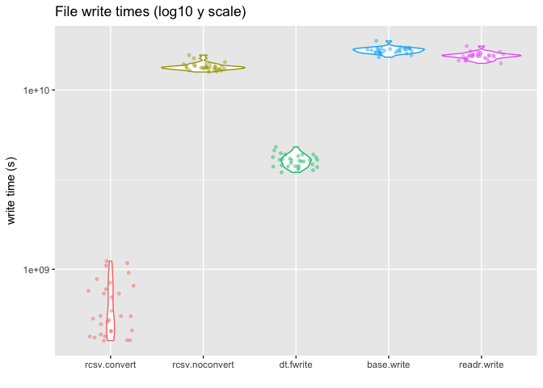
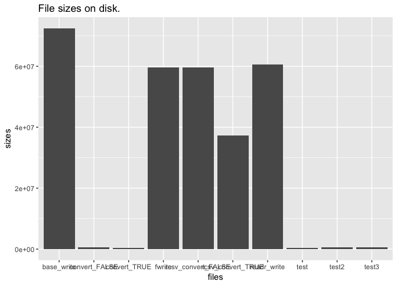
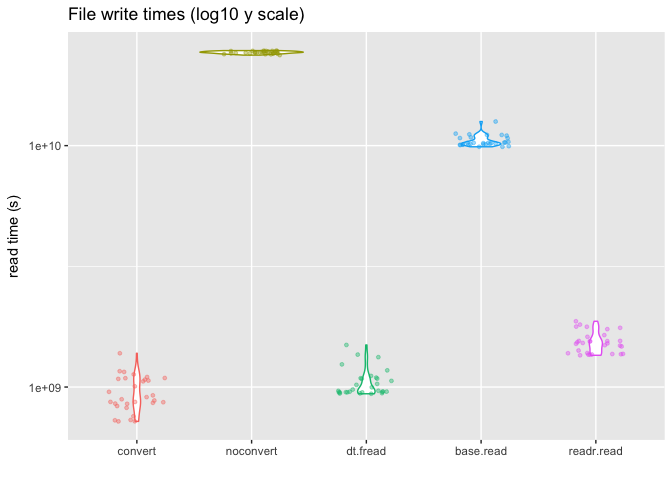

<!-- Do not edit README.md directly, edit README.Rmd instead and re-knit before commit -->
``` r
library( rcsv )
library( data.table )
library( dplyr )
library( readr )
library( ggplot2 )
```

``` r
n <- 1E6
df <- data.frame(
    integers = 1:n,
    letters = sample( letters, n, replace = TRUE ),
    dates = seq.Date( as.Date( "2000-01-01" ), by = 1, length.out = n ),
    posix = seq.POSIXt( as.POSIXct( "2000-01-01 10:00:00", tz = "UTC" ), by = 1000, length.out = n ),
    itime = setattr( sample( seq_len( 86399 ), n, replace = TRUE ), "class", "ITime" ),
    logical = sample( c( TRUE, FALSE ), n, replace = T ),
    factor = factor( sample( c( "new", "old", "other", "really" ), n, replace = TRUE ) ),
    stringsAsFactors = FALSE
)
```

``` r
write.times <- microbenchmark::microbenchmark(
    rcsv.convert = rcsv::write_rcsv( df, "READMEfiles/rcsv_convert_TRUE.rcsv", strings.convert = TRUE ),
    rcsv.noconvert = rcsv::write_rcsv( df, "READMEfiles/rcsv_convert_FALSE.rcsv", strings.convert = FALSE ),
    dt.fwrite = data.table::fwrite( df, "READMEfiles/fwrite.csv", dateTimeAs = "write.csv" ),
    base.write = write.csv( df, "READMEfiles/base_write.csv" ),
    readr.write = readr::write_csv( df, "READMEfiles/readr_write.csv" ),
times = 30, unit = "s" )
#> 
Written 33.3% of 1000000 rows in 4 secs using 8 threads. anyBufferGrown=no; maxBuffUsed=47%. Finished in 8 secs.      
                                                                                                                                     

Written 26.6% of 1000000 rows in 3 secs using 8 threads. anyBufferGrown=no; maxBuffUsed=47%. Finished in 8 secs.      
                                                                                                                                     

Written 20.0% of 1000000 rows in 4 secs using 8 threads. anyBufferGrown=no; maxBuffUsed=47%. Finished in 16 secs.      
                                                                                                                                     

Written 6.7% of 1000000 rows in 3 secs using 8 threads. anyBufferGrown=no; maxBuffUsed=46%. Finished in 42 secs.      
                                                                                                                                     

Written 33.3% of 1000000 rows in 4 secs using 8 threads. anyBufferGrown=no; maxBuffUsed=47%. Finished in 8 secs.      
                                                                                                                                     

Written 20.0% of 1000000 rows in 3 secs using 8 threads. anyBufferGrown=no; maxBuffUsed=47%. Finished in 12 secs.      
Written 73.2% of 1000000 rows in 4 secs using 8 threads. anyBufferGrown=no; maxBuffUsed=47%. Finished in 1 secs.      
                                                                                                                                     

Written 13.3% of 1000000 rows in 4 secs using 8 threads. anyBufferGrown=no; maxBuffUsed=47%. Finished in 26 secs.      
                                                                                                                                     

Written 46.6% of 1000000 rows in 3 secs using 8 threads. anyBufferGrown=no; maxBuffUsed=47%. Finished in 3 secs.      
                                                                                                                                     

Written 39.9% of 1000000 rows in 3 secs using 8 threads. anyBufferGrown=no; maxBuffUsed=47%. Finished in 4 secs.      
                                                                                                                                     

Written 46.6% of 1000000 rows in 3 secs using 8 threads. anyBufferGrown=no; maxBuffUsed=47%. Finished in 3 secs.      
                                                                                                                                     

Written 26.6% of 1000000 rows in 4 secs using 8 threads. anyBufferGrown=no; maxBuffUsed=47%. Finished in 11 secs.      
                                                                                                                                     

Written 13.3% of 1000000 rows in 4 secs using 8 threads. anyBufferGrown=no; maxBuffUsed=47%. Finished in 26 secs.      
                                                                                                                                     

Written 20.0% of 1000000 rows in 3 secs using 8 threads. anyBufferGrown=no; maxBuffUsed=47%. Finished in 12 secs.      
                                                                                                                                     

Written 33.3% of 1000000 rows in 3 secs using 8 threads. anyBufferGrown=no; maxBuffUsed=47%. Finished in 6 secs.      
Written 86.5% of 1000000 rows in 4 secs using 8 threads. anyBufferGrown=no; maxBuffUsed=47%. Finished in 0 secs.      
                                                                                                                                     

Written 20.0% of 1000000 rows in 3 secs using 8 threads. anyBufferGrown=no; maxBuffUsed=47%. Finished in 12 secs.      
                                                                                                                                     

Written 13.3% of 1000000 rows in 4 secs using 8 threads. anyBufferGrown=no; maxBuffUsed=47%. Finished in 26 secs.      
                                                                                                                                     

Written 26.6% of 1000000 rows in 4 secs using 8 threads. anyBufferGrown=no; maxBuffUsed=47%. Finished in 11 secs.      
                                                                                                                                     

Written 26.6% of 1000000 rows in 4 secs using 8 threads. anyBufferGrown=no; maxBuffUsed=47%. Finished in 11 secs.      
                                                                                                                                     

Written 26.6% of 1000000 rows in 4 secs using 8 threads. anyBufferGrown=no; maxBuffUsed=47%. Finished in 11 secs.      
                                                                                                                                     

Written 33.3% of 1000000 rows in 4 secs using 8 threads. anyBufferGrown=no; maxBuffUsed=47%. Finished in 8 secs.      
                                                                                                                                     

Written 39.9% of 1000000 rows in 3 secs using 8 threads. anyBufferGrown=no; maxBuffUsed=47%. Finished in 4 secs.      
                                                                                                                                     

Written 6.7% of 1000000 rows in 4 secs using 8 threads. anyBufferGrown=no; maxBuffUsed=46%. Finished in 56 secs.      
                                                                                                                                     

Written 6.7% of 1000000 rows in 4 secs using 8 threads. anyBufferGrown=no; maxBuffUsed=46%. Finished in 56 secs.      
                                                                                                                                     

Written 26.6% of 1000000 rows in 4 secs using 8 threads. anyBufferGrown=no; maxBuffUsed=47%. Finished in 11 secs.      
                                                                                                                                     

Written 6.7% of 1000000 rows in 3 secs using 8 threads. anyBufferGrown=no; maxBuffUsed=46%. Finished in 42 secs.      
                                                                                                                                     

Written 39.9% of 1000000 rows in 4 secs using 8 threads. anyBufferGrown=no; maxBuffUsed=47%. Finished in 6 secs.      
                                                                                                                                     

Written 20.0% of 1000000 rows in 4 secs using 8 threads. anyBufferGrown=no; maxBuffUsed=47%. Finished in 16 secs.      
                                                                                                                                     

Written 33.3% of 1000000 rows in 4 secs using 8 threads. anyBufferGrown=no; maxBuffUsed=47%. Finished in 8 secs.      
                                                                                                                                     

Written 39.9% of 1000000 rows in 4 secs using 8 threads. anyBufferGrown=no; maxBuffUsed=47%. Finished in 6 secs.      
                                                                                                                                     

Written 20.0% of 1000000 rows in 3 secs using 8 threads. anyBufferGrown=no; maxBuffUsed=47%. Finished in 12 secs.      
Written 73.2% of 1000000 rows in 4 secs using 8 threads. anyBufferGrown=no; maxBuffUsed=47%. Finished in 1 secs.      
                                                                                                                                     

Written 20.0% of 1000000 rows in 4 secs using 8 threads. anyBufferGrown=no; maxBuffUsed=47%. Finished in 16 secs.      
                                                                                                                                     

Written 39.9% of 1000000 rows in 4 secs using 8 threads. anyBufferGrown=no; maxBuffUsed=47%. Finished in 6 secs.      
                                                                                                                                     

Written 6.7% of 1000000 rows in 3 secs using 8 threads. anyBufferGrown=no; maxBuffUsed=46%. Finished in 42 secs.      
                                                                                                                                     

Written 26.6% of 1000000 rows in 3 secs using 8 threads. anyBufferGrown=no; maxBuffUsed=47%. Finished in 8 secs.      
                                                                                                                                     

Written 39.9% of 1000000 rows in 5 secs using 8 threads. anyBufferGrown=no; maxBuffUsed=47%. Finished in 7 secs.      
                                                                                                                                     

Written 6.7% of 1000000 rows in 3 secs using 8 threads. anyBufferGrown=no; maxBuffUsed=46%. Finished in 42 secs.      
Written 59.9% of 1000000 rows in 4 secs using 8 threads. anyBufferGrown=no; maxBuffUsed=47%. Finished in 2 secs.      
                                                                                                                                     

Written 26.6% of 1000000 rows in 4 secs using 8 threads. anyBufferGrown=no; maxBuffUsed=47%. Finished in 11 secs.      
                                                                                                                                     

Written 13.3% of 1000000 rows in 4 secs using 8 threads. anyBufferGrown=no; maxBuffUsed=47%. Finished in 26 secs.      
                                                                                                                                     

Written 20.0% of 1000000 rows in 4 secs using 8 threads. anyBufferGrown=no; maxBuffUsed=47%. Finished in 16 secs.      
                                                                                                                                     

Written 20.0% of 1000000 rows in 4 secs using 8 threads. anyBufferGrown=no; maxBuffUsed=47%. Finished in 16 secs.      
                                                                                                                                     

Written 6.7% of 1000000 rows in 4 secs using 8 threads. anyBufferGrown=no; maxBuffUsed=46%. Finished in 56 secs.      
                                                                                                                                     

Written 33.3% of 1000000 rows in 3 secs using 8 threads. anyBufferGrown=no; maxBuffUsed=47%. Finished in 6 secs.      
                                                                                                                                     

Written 46.6% of 1000000 rows in 4 secs using 8 threads. anyBufferGrown=no; maxBuffUsed=47%. Finished in 4 secs.      
                                                                                                                                     

Written 13.3% of 1000000 rows in 3 secs using 8 threads. anyBufferGrown=no; maxBuffUsed=47%. Finished in 19 secs.      
                                                                                                                                     

Written 39.9% of 1000000 rows in 3 secs using 8 threads. anyBufferGrown=no; maxBuffUsed=47%. Finished in 4 secs.      
Written 93.2% of 1000000 rows in 4 secs using 8 threads. anyBufferGrown=no; maxBuffUsed=47%. Finished in 0 secs.      
                                                                                                                                     

Written 33.3% of 1000000 rows in 4 secs using 8 threads. anyBufferGrown=no; maxBuffUsed=47%. Finished in 8 secs.      
                                                                                                                                     

Written 26.6% of 1000000 rows in 4 secs using 8 threads. anyBufferGrown=no; maxBuffUsed=47%. Finished in 11 secs.      
Written 79.9% of 1000000 rows in 5 secs using 8 threads. anyBufferGrown=no; maxBuffUsed=47%. Finished in 1 secs.      
                                                                                                                                     

Written 13.3% of 1000000 rows in 4 secs using 8 threads. anyBufferGrown=no; maxBuffUsed=47%. Finished in 26 secs.      
                                                                                                                                     

Written 26.6% of 1000000 rows in 3 secs using 8 threads. anyBufferGrown=no; maxBuffUsed=47%. Finished in 8 secs.      
                                                                                                                                     

Written 6.7% of 1000000 rows in 4 secs using 8 threads. anyBufferGrown=no; maxBuffUsed=46%. Finished in 56 secs.      
                                                                                                                                     

Written 20.0% of 1000000 rows in 3 secs using 8 threads. anyBufferGrown=no; maxBuffUsed=47%. Finished in 12 secs.      
Written 73.2% of 1000000 rows in 4 secs using 8 threads. anyBufferGrown=no; maxBuffUsed=47%. Finished in 1 secs.      
                                                                                                                                     

Written 26.6% of 1000000 rows in 3 secs using 8 threads. anyBufferGrown=no; maxBuffUsed=47%. Finished in 8 secs.      
Written 79.9% of 1000000 rows in 4 secs using 8 threads. anyBufferGrown=no; maxBuffUsed=47%. Finished in 1 secs.      
                                                                                                                                     

Written 46.6% of 1000000 rows in 4 secs using 8 threads. anyBufferGrown=no; maxBuffUsed=47%. Finished in 4 secs.      
                                                                                                                                     

Written 33.3% of 1000000 rows in 3 secs using 8 threads. anyBufferGrown=no; maxBuffUsed=47%. Finished in 6 secs.      
                                                                                                                                     

Written 6.7% of 1000000 rows in 3 secs using 8 threads. anyBufferGrown=no; maxBuffUsed=46%. Finished in 42 secs.      
                                                                                                                                     

Written 33.3% of 1000000 rows in 4 secs using 8 threads. anyBufferGrown=no; maxBuffUsed=47%. Finished in 8 secs.      
                                                                                                                                     

Written 20.0% of 1000000 rows in 4 secs using 8 threads. anyBufferGrown=no; maxBuffUsed=47%. Finished in 16 secs.      
                                                                                                                                     

Written 6.7% of 1000000 rows in 3 secs using 8 threads. anyBufferGrown=no; maxBuffUsed=46%. Finished in 42 secs.      
Written 59.9% of 1000000 rows in 4 secs using 8 threads. anyBufferGrown=no; maxBuffUsed=47%. Finished in 2 secs.      
                                                                                                                                     

Written 13.3% of 1000000 rows in 4 secs using 8 threads. anyBufferGrown=no; maxBuffUsed=47%. Finished in 26 secs.      
                                                                                                                                     

Written 6.7% of 1000000 rows in 4 secs using 8 threads. anyBufferGrown=no; maxBuffUsed=46%. Finished in 56 secs.      
                                                                                                                                     
ggplot( write.times, aes( expr, time, colour = expr ) ) +
    geom_violin( show.legend = FALSE ) +
    geom_jitter( size = 1, alpha = 0.4, width = 0.25, show.legend = FALSE ) +
    ylab( "write time (s)" ) + xlab( "" ) +
    scale_y_log10() +
    labs( title = "File write times (log10 y scale)" )
```



``` r
files <- list.files( "READMEfiles/", full.names = TRUE )
sizes <- file.info( files )$size
ggplot( data = data.frame( files = gsub( ".*\\/|\\..*", "", files ), size = sizes ),
        mapping = aes( files, sizes ) ) +
    geom_col() +
    labs( title = "File sizes on disk." )
```



``` r
read.times <- microbenchmark::microbenchmark(
    convert = { df.convert <- rcsv::read_rcsv( "READMEfiles/rcsv_convert_TRUE.rcsv" ) },
    noconvert = { df.noconvert <- rcsv::read_rcsv( "READMEfiles/rcsv_convert_FALSE.rcsv" ) },
    dt.fread = { df.fread <- fread( "READMEfiles/fwrite.csv" ) },
    base.read = { df.base <- read.csv( "READMEfiles/base_write.csv" ) },
    readr.read = { df.readr <- readr::read_csv( "READMEfiles/readr_write.csv" ) },
times = 30, unit = "seconds" )
ggplot( read.times, aes( expr, time, colour = expr ) ) +
    geom_violin( show.legend = FALSE ) +
    geom_jitter( size = 1, alpha = 0.4, width = 0.25, show.legend = FALSE ) +
    ylab( "read time (s)" ) + xlab( "" ) +
    labs( title = "File write times (log10 y scale)" ) +
    scale_y_log10()
```



Test for correct data read.

``` r
tests <- lapply( X = list( df.convert = df.convert,
                           df.noconvert = df.noconvert,
                           df.fread = df.fread,
                           df.base = df.base,
                           df.readr = df.readr ),
                 FUN = function(x) {
                     sapply( seq_along( df ),
                             function(i) all.equal( df[[i]], x[[i]] )
                     )
                 }
)
```
