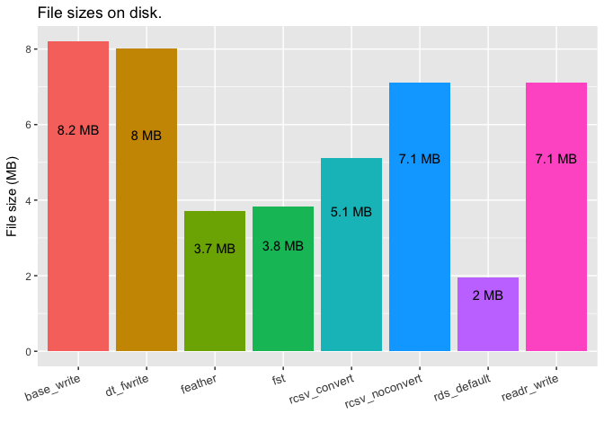
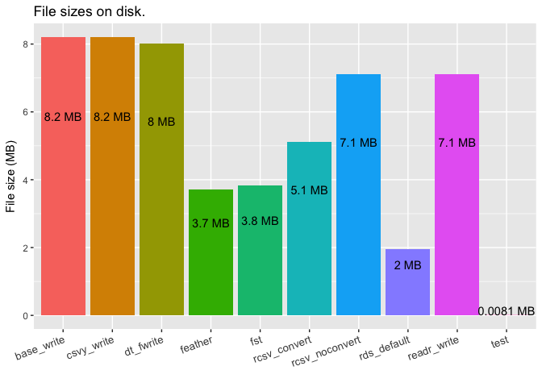
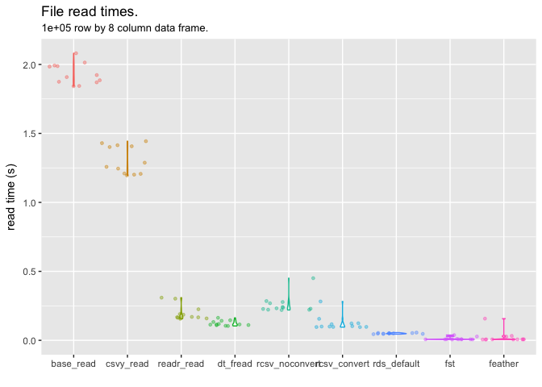

<!-- Do not edit README.md directly, edit README.Rmd instead and re-knit before commit -->
The rcsv format.
----------------

The basic idea behind this format is to add a header section to the regular csv format, containing information about the data frame being stored, in such a way as to allow easy reading and writing of data to and from file, without losing the structure of the original data. Specifically designed for storing data frame (or data table) objects, details stored in the header include the dimensions of the data frame, and the class of each column. This means that the data frame can be read back into memory when required, without the need to specify column classes on input, nor perform column manipulations after import. The data will be brought back into memory in (almost) exactly the form it was in when it was saved.

``` r
library( rcsv )
library( data.table )
library( dplyr )
library( readr )
library( ggplot2 )
```

Why not rds, feather, fst...?
-----------------------------

Personally, I like to work with binary files, and not having to worry about things like classes, timezones, etc. However, these binary formats are often not suitable in certain workflows, for example where collaborators may not be working in R\*. It can also be beneficial in certain workflows to have meaningful diffs when a data file is changed, in order to work with version control systems like git.

So to make the data as generally accessible as possible, and allowing for meaningful diffs, while maintaining the ability to write out and read in data without losing important attributes, is the aim here.

-   `feather` tries to address this with compatibility in both R and python, but this still can't encompass everyone's collaborators.

Testing
-------

### Set up some test data

We'll look at a test data frame, using several different column types. The `rcsv` package is specifically designed to work with the following column types, while others may or may not work well (please do your own testing): character, numeric, integer, logical, factor, Date, POSIXct, ITime, IDate, times

``` r
testDF <- function( n ) {
    data.frame(
        integers = 1:n,
        letters = sample( letters, n, replace = TRUE ),
        dates = sample(
            seq.Date( as.Date( "1970-01-01" ), as.Date( "2199-12-31" ), by = 1 ),
            n, replace = TRUE ),
        posix = as.POSIXct( seq.int( 1E6, by = 1000, length.out = n ), tz = "EST", origin = "1970-01-01 00:00:00" ),
        itime = setattr( sample( seq_len( 86399 ), n, replace = TRUE ), "class", "ITime" ),
        logical = sample( c( TRUE, FALSE ), n, replace = T ),
        factor = factor( sample( c( "small", "medium", "large", "extra-large" ), n, replace = TRUE ),
                         levels = c( "small", "medium", "large", "extra-large" )  ),
        times = chron::times( seq.int( from = 0.001, to = 0.999, length.out = n ) ),
        stringsAsFactors = FALSE
    )
}

set.seed( 123 )
df <- testDF( n = 100 )
glimpse( df, width = 80 )
#> Observations: 100
#> Variables: 8
#> $ integers <int> 1, 2, 3, 4, 5, 6, 7, 8, 9, 10, 11, 12, 13, 14, 15, 16, 17,...
#> $ letters  <chr> "h", "u", "k", "w", "y", "b", "n", "x", "o", "l", "y", "l"...
#> $ dates    <date> 2107-12-31, 2046-07-20, 2082-05-19, 2189-07-12, 2081-01-2...
#> $ posix    <dttm> 1970-01-12 08:46:40, 1970-01-12 09:03:20, 1970-01-12 09:2...
#> $ itime    <S3: ITime> 05:43:46, 23:05:47, 14:25:58, 12:21:39, 09:39:42, 21...
#> $ logical  <lgl> FALSE, TRUE, FALSE, FALSE, FALSE, TRUE, TRUE, TRUE, TRUE, ...
#> $ factor   <fctr> extra-large, small, extra-large, large, medium, medium, l...
#> $ times    <S3: times> 00:01:26, 00:15:57, 00:30:28, 00:44:59, 00:59:30, 01...
```

### Add notes

An important feature of the `rcsv` format is the ability to include notes on the data within the file itself. We'll do that here for demonstration.

``` r
notes_replace( df, "Here's an example note." )
#> Notes:   Here's an example note.
```

``` r
notes_add( df, "And another one." )
#> Notes:   Here's an example note.
#>  And another one.
```

### write\_rcsv with default parameters

A simple call to `write_rcsv` will write out the object to csv as with any csv writing function. The notes are printed to the console on file write.

``` r
testfile <- "READMEfiles/test.rcsv"
write_rcsv( df, testfile )
#> Notes:  Here's an example note.
#>  And another one.
```

Noticee that at the top of this file though, is a (JSON-like) header:

``` r
readLines( testfile, n = 12 )
#>  [1] "#{rcsvHeader},{headlines:11},{noteslines:2},{colreflines:8},{tablerows:100}"                         
#>  [2] "#{notes:Here's an example note.}"                                                                    
#>  [3] "#{notes:And another one.}"                                                                           
#>  [4] "#{colref:1},{colname:integers},{colclass:integer}"                                                   
#>  [5] "#{colref:2},{colname:letters},{colclass:character}"                                                  
#>  [6] "#{colref:3},{colname:dates},{colclass:Date},{from:string}"                                           
#>  [7] "#{colref:4},{colname:posix},{colclass:POSIXct},{tz:EST},{tzoffset:-18000},{from:string}"             
#>  [8] "#{colref:5},{colname:itime},{colclass:ITime},{from:string}"                                          
#>  [9] "#{colref:6},{colname:logical},{colclass:logical},{from:long}"                                        
#> [10] "#{colref:7},{colname:factor},{colclass:factor},{levels:small,medium,large,extra-large},{from:string}"
#> [11] "#{colref:8},{colname:times},{colclass:times},{from:string}"                                          
#> [12] "integers,letters,dates,posix,itime,logical,factor,times"
```

The first line of the file contains some basic details about the file structure, below which is a series of lines specifying details of each column. This "header" section will be used by `read_rcsv` to import the data frame in a manner matching the file written out, without the need for special parameters on the read call, or additional manipulations after import.

Before importing the file, we can take a look at it in a few ways. `glimpse_rcsv` shows important details about the file, including notes and a `dplyr::glimpse`-alike view of the dataset, without loading the file into memory. (We go a little more into the `glimpse` function later.)

``` r
glimpse_rcsv( testfile )
#> 
#> 
#>  file:        READMEfiles/test.rcsv 
#>  total cols:  8 
#>  total rows:  100 
#> 
#>  Notes:       Here's an example note.
#>       And another one. 
#> 
#>  "integers" <int> 1,2,3,4,5,6,7,8,9,10,11,12,13,14,15,16,17,18,19,20,21...
#>  "letters" <char> h,u,k,w,y,b,n,x,o,l,y,l,r,o,c,x,g,b,i,y,x...
#>  "dates" <date> 2107-12-31,2046-07-20,2082-05-19,2189-07-12,2081-01-24,2174-10-1...
#>  "posix" <posx> 1970-01-12 08:46:40,1970-01-12 09:03:20,1970-01-12 09:20:00,1970...
#>  "itime" <itim> 05:43:46,23:05:47,14:25:58,12:21:39,09:39:42,21:07:33,08:44:18,0...
#>  "logical" <logi> FALSE,TRUE,FALSE,FALSE,FALSE,TRUE,TRUE,TRUE,TRUE,TRUE,TRUE,TRUE,...
#>  "factor" <fct> extra-large,small,extra-large,large,medium,medium,large,small,me...
#>  "times" <time> 00:01:26,00:15:57,00:30:28,00:44:59,00:59:30,01:14:01,01:28:32,0...
```

`notes_rcsv` shows just the notes.

``` r
notes_rcsv( testfile )
#> Notes:   Here's an example note.
#>  And another one.
```

``` r
df.readrcsv <- read_rcsv( testfile )
#> Notes:  Here's an example note.
#>  And another one.
```

``` r
dplyr::glimpse( df.readrcsv, width = 80 )
#> Observations: 100
#> Variables: 8
#> $ integers <int> 1, 2, 3, 4, 5, 6, 7, 8, 9, 10, 11, 12, 13, 14, 15, 16, 17,...
#> $ letters  <chr> "h", "u", "k", "w", "y", "b", "n", "x", "o", "l", "y", "l"...
#> $ dates    <date> 2107-12-31, 2046-07-20, 2082-05-19, 2189-07-12, 2081-01-2...
#> $ posix    <dttm> 1970-01-12 08:46:40, 1970-01-12 09:03:20, 1970-01-12 09:2...
#> $ itime    <S3: ITime> 05:43:46, 23:05:47, 14:25:58, 12:21:39, 09:39:42, 21...
#> $ logical  <lgl> FALSE, TRUE, FALSE, FALSE, FALSE, TRUE, TRUE, TRUE, TRUE, ...
#> $ factor   <fctr> extra-large, small, extra-large, large, medium, medium, l...
#> $ times    <S3: times> 00:01:26, 00:15:57, 00:30:28, 00:44:59, 00:59:30, 01...
```

All columns have been read in with identical column classes as the original test data frame.

Note that since the header section is designated by a \# at the beginning of each line. This means that any csv reader can still read the file, with "\#" passed as a comment character.

``` r
df.base <- read.csv( testfile, comment.char = "#" )
glimpse( df.base, width = 80 )
#> Observations: 100
#> Variables: 8
#> $ integers <int> 1, 2, 3, 4, 5, 6, 7, 8, 9, 10, 11, 12, 13, 14, 15, 16, 17,...
#> $ letters  <fctr> h, u, k, w, y, b, n, x, o, l, y, l, r, o, c, x, g, b, i, ...
#> $ dates    <fctr> 2107-12-31, 2046-07-20, 2082-05-19, 2189-07-12, 2081-01-2...
#> $ posix    <fctr> 1970-01-12T08:46:40Z, 1970-01-12T09:03:20Z, 1970-01-12T09...
#> $ itime    <fctr> 05:43:46, 23:05:47, 14:25:58, 12:21:39, 09:39:42, 21:07:3...
#> $ logical  <lgl> FALSE, TRUE, FALSE, FALSE, FALSE, TRUE, TRUE, TRUE, TRUE, ...
#> $ factor   <fctr> extra-large, small, extra-large, large, medium, medium, l...
#> $ times    <fctr> 00:01:26, 00:15:57, 00:30:28, 00:44:59, 00:59:30, 01:14:0...
```

Using a regular reader however, will not necessarily import the columns correctly (note several incorrect import formats above). Even with the very good `readr` package, which does a great job, we won't always correctly attribute the original column classes, because there is ambiguity on the user's original intent.

``` r
df.readr <- readr::read_csv( testfile, comment = "#" )
glimpse( df.readr, width = 80 )
#> Observations: 100
#> Variables: 8
#> $ integers <int> 1, 2, 3, 4, 5, 6, 7, 8, 9, 10, 11, 12, 13, 14, 15, 16, 17,...
#> $ letters  <chr> "h", "u", "k", "w", "y", "b", "n", "x", "o", "l", "y", "l"...
#> $ dates    <date> 2107-12-31, 2046-07-20, 2082-05-19, 2189-07-12, 2081-01-2...
#> $ posix    <dttm> 1970-01-12 08:46:40, 1970-01-12 09:03:20, 1970-01-12 09:2...
#> $ itime    <time> 05:43:46, 23:05:47, 14:25:58, 12:21:39, 09:39:42, 21:07:3...
#> $ logical  <lgl> FALSE, TRUE, FALSE, FALSE, FALSE, TRUE, TRUE, TRUE, TRUE, ...
#> $ factor   <chr> "extra-large", "small", "extra-large", "large", "medium", ...
#> $ times    <time> 00:01:26, 00:15:57, 00:30:28, 00:44:59, 00:59:30, 01:14:0...
```

Some of these issues will be easily fixed, like converting factors to strings, or vice-versa. Some are less simple though, for example timezones are generally\* not printed to csv files, meaning they are often read into memory with different timezone attributes from the original data frame. This can be difficult to notice if special care is not taken, and can have serious consequences. \*worth noting that `data.table::fwrite` does have a facility for this

``` r
cat( "Testing for timezone changes:\n",
     "from original data frame:\t", as.character( df$posix[1] ), attr( df$posix[1], "tzone" ), "\n",
     "using read_rcsv:\t\t\t", as.character( df.readrcsv$posix[1] ), attr( df.readrcsv$posix[1], "tzone" ), "\n",
     "using readr::read_csv:\t\t", as.character( df.readr$posix[1] ), attr( df.readr$posix[1], "tzone" ), "\n",
     "using base::read.csv:\t\t", as.character( df.base$posix[1] ), attr( df.base$posix[1], "tzone" ), "\n" )
#> Testing for timezone changes:
#>  from original data frame:    1970-01-12 08:46:40 EST 
#>  using read_rcsv:             1970-01-12 08:46:40 EST 
#>  using readr::read_csv:       1970-01-12 08:46:40 UTC 
#>  using base::read.csv:        1970-01-12T08:46:40Z
```

`factor` columns also raise an issue here, where they may be correctly read in as factor, but associated incorrect levels, which may have consequences on further data analysis:

``` r
cat( "Testing for factor level changes:\n",
     "from original data frame:\t", levels( df$factor ), "\n",
     "using read_rcsv:\t\t\t", levels( df.readrcsv$factor ), "\n",
     "using readr::read_csv:\t\t", levels( df.readr$factor ), "\n",
     "using base::read.csv:\t\t", levels( df.base$factor ) )
#> Testing for factor level changes:
#>  from original data frame:    small medium large extra-large 
#>  using read_rcsv:             small medium large extra-large 
#>  using readr::read_csv:       
#>  using base::read.csv:        extra-large large medium small
```

`readr` defaults all columns without other conversion triggers to `character` class (hence there are no levels to display here). `read.csv` defaults these columns to `factor` class, but automatically sorts levels in alphabetical order, which may not be appropriate, as is the case here. `rcsv` determines whether or not to convert a column to factor based on the data frame from which it was written, and stores then extracts the correct factor levels, including their order.

### using write\_rcsv with data conversion options

The `write_rcsv` function includes several options for "compressing" the csv output file by changing the way some columns are represented. We can control each conversion type individually with their respective parameters, or we can turn all of these options on with a single parameter, `strings.convert`.

``` r
rcsv::write_rcsv( df, testfile, strings.convert = TRUE )
#> Notes:  Here's an example note.
#>  And another one.
readLines( testfile, n = 12 )
#>  [1] "#{rcsvHeader},{headlines:11},{noteslines:2},{colreflines:8},{tablerows:100}"                                                      
#>  [2] "#{notes:Here's an example note.}"                                                                                                 
#>  [3] "#{notes:And another one.}"                                                                                                        
#>  [4] "#{colref:1},{colname:integers},{colclass:integer}"                                                                                
#>  [5] "#{colref:2},{colname:letters},{colclass:character},{levels:a,b,c,d,e,f,g,h,i,j,k,l,m,n,o,p,q,r,s,t,u,v,w,x,y,z},{from:factorints}"
#>  [6] "#{colref:3},{colname:dates},{colclass:Date},{from:integer}"                                                                       
#>  [7] "#{colref:4},{colname:posix},{colclass:POSIXct},{tz:EST},{tzoffset:-18000},{from:integer}"                                         
#>  [8] "#{colref:5},{colname:itime},{colclass:ITime},{from:integer}"                                                                      
#>  [9] "#{colref:6},{colname:logical},{colclass:logical},{from:integer}"                                                                  
#> [10] "#{colref:7},{colname:factor},{colclass:factor},{levels:small,medium,large,extra-large},{from:integer}"                            
#> [11] "#{colref:8},{colname:times},{colclass:times},{from:numeric}"                                                                      
#> [12] "integers,letters,dates,posix,itime,logical,factor,times"
```

The data itself here looks significantly different from the regular csv. character strings, factors, dates, times, and logical objects are all being represented in integer or numeric form, to be converted back to their respective classes on import using the information stored in the header, without any extra parameters needing to be passed to the import call:

``` r
df.readrcsv.convert <- read_rcsv( testfile )
#> Notes:  Here's an example note.
#>  And another one.
glimpse( df.readrcsv.convert )
#> Observations: 100
#> Variables: 8
#> $ integers <int> 1, 2, 3, 4, 5, 6, 7, 8, 9, 10, 11, 12, 13, 14, 15, 16...
#> $ letters  <chr> "h", "u", "k", "w", "y", "b", "n", "x", "o", "l", "y"...
#> $ dates    <date> 2107-12-31, 2046-07-20, 2082-05-19, 2189-07-12, 2081...
#> $ posix    <dttm> 1970-01-12 08:46:40, 1970-01-12 09:03:20, 1970-01-12...
#> $ itime    <S3: ITime> 05:43:46, 23:05:47, 14:25:58, 12:21:39, 09:39:4...
#> $ logical  <lgl> FALSE, TRUE, FALSE, FALSE, FALSE, TRUE, TRUE, TRUE, T...
#> $ factor   <fctr> extra-large, small, extra-large, large, medium, medi...
#> $ times    <S3: times> 00:01:26, 00:15:57, 00:30:28, 00:44:59, 00:59:3...
```

File writing.
-------------

### Why use conversions?

By converting columns in this way, we may save disk space\*, as well as speed up reading and writing, while retaining the original data, and maintaining meaningful diffs. It is certainly less of a "general" data storage method (although the details needed to convert back to the original data types is mostly human-readable in the header, but I digress...) than without these conversions, but it may be useful in some situations.

To see the file size and speed advantages, we'll create a more meaningful (bigger) dataset, and write it to files with several different methods.

-   Character columns with highly repeated string fields will benefit greatly, whereas those with completely unique string fields will not. `Date`, `ITime`, and `IDate` formats are all more efficiently stored as integers than character strings, and will generally convert to their proper classes faster from integers than from character strings. `POSIXct` is likewise more efficiently converted from numeric, and this also makes storage of greater precision than 1s simpler and more efficient. Similarly, `times` format values stored as numeric enables greater than 1s precision values to be stored and retrieved, however in some cases may increase storage size (where the decimal values convert to longer strings than the formatted time value).

### File write speeds

We test the speed of file writing between a few of the methods available to an R user.

``` r
n <- 1E5
df <- testDF( n )
write.times <- microbenchmark::microbenchmark(
    base_write = write.csv( df, "READMEfiles/base_write.csv" ),
    readr_write = readr::write_csv( df, "READMEfiles/readr_write.csv" ),
    dt_fwrite = data.table::fwrite( df, "READMEfiles/dt_fwrite.csv" ),
    rcsv_noconvert = rcsv::write_rcsv( df, "READMEfiles/rcsv_noconvert.rcsv" ),
    rcsv_convert = rcsv::write_rcsv( df, "READMEfiles/rcsv_convert.rcsv", strings.convert = TRUE ),
    rds_default = saveRDS( df, "READMEfiles/rds_default.rds" ),
    fst = fst::write.fst( df, "READMEfiles/fst.fst" ),
    feather = feather::write_feather( df, "READMEfiles/feather.feather" ),
    times = 12
)
write.times
#> Unit: milliseconds
#>            expr         min          lq        mean      median
#>      base_write 1443.225465 1502.656276 1578.110362 1553.346403
#>     readr_write 1221.255362 1295.262282 1330.022583 1335.235287
#>       dt_fwrite   15.916950   16.189959   35.281099   16.578532
#>  rcsv_noconvert   56.250162   62.242014  106.617409   89.231216
#>    rcsv_convert   23.792785   23.933099   37.223181   24.269112
#>     rds_default  372.352141  374.994775  377.195577  377.804246
#>             fst    3.809448    3.864523   15.420128    3.921533
#>         feather    4.818591    4.872651    7.360614    4.940223
#>           uq        max neval
#>  1621.184513 1859.69566    12
#>  1358.287101 1416.43248    12
#>    26.054796  156.75417    12
#>   141.602549  199.42766    12
#>    36.268625  136.92847    12
#>   379.183261  380.80144    12
#>     6.135300   88.90081    12
#>     5.782434   25.68775    12
```

`write_rcsv` is built around the fantastic `data.table::fwrite` function, making it much faster than both `base::write.csv` and `readr::write_csv`. It even maintains relatively good performance compared with `data.table::fwrite`, but is slowed a little by the conversion processes and header writing steps.

``` r
ggplot( write.times,
        mapping = aes( expr, time/1E9, colour = expr ) ) +
    geom_violin( show.legend = FALSE ) +
    geom_jitter( size = 1, alpha = 0.4, width = 0.25, show.legend = FALSE ) +
    ylab( "write time (s)" ) + xlab( "" ) +
    ylim( c( 0, NA ) ) +
    labs( title = "File write times.",
          subtitle = sprintf( "%s row by %s column data frame.", n, ncol( df ) ) )
```


The speed differences between `dt.fwrite`, `rcsv.noconvert`, and `rcsv.convert` seen here are the result of additional processing in the `write_rcsv` function (slowing it down), and the advantage of writing fewer characters to file (speeding it up where `strings.convert` == TRUE). Without string conversions, `rcsv` generally writes with comparable speed to `saveRDS`, while turning the string conversions on can make it significantly faster.

### File sizes

``` r
files <- list.files( path = "READMEfiles/", full.names = TRUE )
files <- files[ !grepl( "test.rcsv", files ) ]
sizes <- file.info( files )$size

ggplot( data = data.frame( files = gsub( ".*\\/|\\..*", "", files ), size = sizes ),
        mapping = aes( files, sizes/1E6, fill = files ) ) +
    geom_col( show.legend = FALSE ) +
    labs( title = "File sizes on disk." ) +
    xlab( "" ) + ylab( "File size (MB)" ) +
    theme(axis.text.x = element_text(size = 10, angle = 20, hjust = 1)) +
    geom_text( aes( label = paste( signif( sizes/1E6, 2 ), "MB" ), y = 0.7 * sizes/1E6 ),
               position = position_dodge(0.9),
               vjust = 0
    )
```



Note most csv writers create files of similar sizes, but the `rcsv` format with string conversions can (in some circumstances) result in significant file size reductions. We do not have the same file size benefit of the compressed (as per default settings) `rds` format, so if file size is of paramount importance, it may be worth sticking with the rds format, or including an extra file compression step to your workflow; that is not the primary concern here though.

### File read times

``` r
read.times <- microbenchmark::microbenchmark(
    base_read = { df.base <- read.csv( "READMEfiles/base_write.csv" ) },
    readr_read = { df.readr <- readr::read_csv( "READMEfiles/readr_write.csv" ) },
    dt_fread = { df.fread <- data.table::fread( "READMEfiles/dt_fwrite.csv" ) },
    rcsv_noconvert = { df.noconvert <- rcsv::read_rcsv( "READMEfiles/rcsv_noconvert.rcsv" ) },
    rcsv_convert = { df.convert <- rcsv::read_rcsv( "READMEfiles/rcsv_convert.rcsv" ) },
    rds_default = { df.rds <- readRDS( "READMEfiles/rds_default.rds" ) },
    fst = { df.fst <- fst::read.fst( "READMEfiles/fst.fst" ) },
    feather = { df.feather <- feather::read_feather( "READMEfiles/feather.feather" ) },
    times = 12
)
read.times
#> Unit: milliseconds
#>            expr        min         lq       mean     median         uq
#>       base_read 814.308740 844.492948 880.434284 853.899882 930.306224
#>      readr_read 124.591556 134.556925 162.925143 142.053381 204.145846
#>        dt_fread  74.395278  81.236267  90.638950  84.762014  94.709424
#>  rcsv_noconvert 139.979558 144.438235 161.397583 168.289216 171.503119
#>    rcsv_convert  72.676689  91.212814 121.716011  95.867846 150.219459
#>     rds_default  34.872713  35.532128  38.386559  35.718348  36.777367
#>             fst   3.128357   3.194956  22.864712   3.618270  18.556116
#>         feather   2.695026   2.775343   3.047929   2.925985   3.271799
#>         max neval
#>  980.798262    12
#>  231.952405    12
#>  125.853915    12
#>  182.611449    12
#>  217.666965    12
#>   60.383518    12
#>  105.344794    12
#>    3.879892    12
```

``` r
ggplot( data = read.times, #setDT( read.times )[ grepl( "^rcsv|^dt|^rds|^fst|^feather", expr ) ], 
        mapping = aes( expr, time/1E9, colour = expr ) ) +
    geom_violin( show.legend = FALSE ) +
    geom_jitter( size = 1, alpha = 0.4, width = 0.25, show.legend = FALSE ) +
    ylab( "read time (s)" ) + xlab( "" ) +
    ylim( c( 0, NA ) ) +
    labs( title = "File read times.",
          subtitle = sprintf( "%s row by %s column data frame.", n, ncol( df ) ) )
```



We can see here that when reading in data, the speed of `rcsv` is excellent if conversions are used, and very competitive even without conversions. Note the time spent here is on applying conversions to the data on import. These conversions would usually need to be performed manually after import, meaning that a more appropriate comparison between both forms of `read_rcsv` and other read methods may be to include those conversion steps

``` r
read.times.with.manipulations <- microbenchmark::microbenchmark(
    readr_read = {
        df.readr.manip <- readr::read_csv( "READMEfiles/readr_write.csv",
                                           col_types = cols(
                                               col_integer(),
                                               col_character(),
                                               col_date(),
                                               col_datetime(),
                                               col_time(),
                                               col_logical(),
                                               col_factor(
                                                   levels = c( "small", "medium", "large", "extra-large" )
                                               ),
                                               col_time()
                                           ) ) %>%
            mutate( posix = lubridate::with_tz( posix, tzone = "EST" ),
                    itime = as.ITime( itime ),
                    times = chron::times( times ) )
        },
    dt_fread = { 
        df.fread.manip <- data.table::fread( "READMEfiles/dt_fwrite.csv" )
        df.fread.manip[ , dates := as.Date( dates )
                     ][ , posix := fasttime::fastPOSIXct( posix, tz = "EST" )
                     ][ , itime := as.ITime( itime )
                     ][ , factor := factor( factor, levels = c( "small", "medium", "large", "extra-large" ) )
                     ][ , times := chron::times( times ) ] },
    rcsv_noconvert = { df.noconvert <- rcsv::read_rcsv( "READMEfiles/rcsv_noconvert.rcsv" ) },
    rcsv_convert = { df.convert <- rcsv::read_rcsv( "READMEfiles/rcsv_convert.rcsv" ) },
    times = 12
)
read.times.with.manipulations
#> Unit: milliseconds
#>            expr       min        lq      mean    median        uq      max
#>      readr_read 489.54103 520.20777 548.47964 538.55969 591.32222 599.0410
#>        dt_fread 490.54643 494.75862 520.39188 505.68648 516.50696 620.5011
#>  rcsv_noconvert 139.40223 156.68906 184.14517 168.84559 213.25729 254.2323
#>    rcsv_convert  72.26905  73.96774  93.80176  91.04462  94.15109 196.0591
#>  neval
#>     12
#>     12
#>     12
#>     12
```

``` r
ggplot( setDT( read.times.with.manipulations )[ grepl( "^base|^readr|^rcsv|^dt", expr ) ],
        mapping = aes( expr, time/1E9, colour = expr ) ) +
    geom_violin( show.legend = FALSE ) +
    geom_jitter( size = 1, alpha = 0.4, width = 0.25, show.legend = FALSE ) +
    ylab( "read time (s)" ) + xlab( "" ) +
    ylim( c( 0, NA ) ) +
    labs( title = "File read times, with column manipulations where necessary.",
          subtitle = sprintf( "%s row by %s column data frame.", n, ncol( df ) ) )
```



So, assuming you'll be performing the necessary data conversions on import, `fread` is actually significantly slower than `rcsv`. In the case of `rcsv_convert`, this is due to the fact that converting from numeric variables is often faster than from character. In the case of `rcsv_noconvert`, it is largely due to the use of several speed optimisations, including the use of the `fasttime` package in converting Date and POSIXct variables, which offers significant speed improvements over `as.Date` and `as.POSIXct` functions.

Data integrity
--------------

### Testing that the data has been read in correctly.

To test for correct data read, ee look at each column of each imported data frame, and compare it to the matching column in the original data frame. In this way, we see if the data has remained consistent through the write/read process.

``` r
tests <- lapply( X = list( df.convert = df.convert,
                           df.noconvert = df.noconvert,
                           df.fread.manip = df.fread.manip,
                           df.readr.manip = df.readr.manip ),
                 FUN = function(x) {
                     sapply( seq_along( df ),
                             function(i) all.equal( df[[i]], x[[i]] )
                     )
                 }
) %>%
    lapply( function(x) paste( x, collapse = ", " ) )
print( tests )
#> $df.convert
#> [1] "TRUE, TRUE, TRUE, TRUE, TRUE, TRUE, TRUE, TRUE"
#> 
#> $df.noconvert
#> [1] "TRUE, TRUE, TRUE, TRUE, TRUE, TRUE, TRUE, Mean relative difference: 5.787027e-06"
#> 
#> $df.fread.manip
#> [1] "TRUE, TRUE, TRUE, TRUE, TRUE, TRUE, TRUE, TRUE"
#> 
#> $df.readr.manip
#> [1] "TRUE, TRUE, TRUE, TRUE, TRUE, TRUE, TRUE, Mean relative difference: 5.787027e-06"
```

It's clear here that imports using regular csv readers will need some work to bring the data back to the way it should be. This manipulation needs to be repeated every time a dataset is read into memory, which can be quite prohibitive to a smooth workflow. With `rcsv`, the data is read back into R in the same form as before it was written out\*, with no additional time or effort on the part of the user.

-   the one exception here is where `times` values have been stored without numeric conversion. The slight discrepancy in the values retrieved is due to the conversion of greater than 1s precision time values to formatted strings ("h:m:s"), which does not allow for the storage of such high precision. Turning conversion on in the `write_rcsv` call solves this by storing as numeric, and therefore retaining the precision of the original data. `fwrite` defaults to writing `times` values as numeric, but we overwrite this where necessary to create a more portable csv file (times written out as "h:m:s" character strings).

Additional features
-------------------

### Notes, an added detail to your datasets

Sometimes it's important to include a few brief notes with your dataset. Maybe the specs for a piece of equipment used to collect the data, or maybe something that a user of the dataset should be aware of when working with it. The `rcsv` format has this facility built in. You can add a note to your data frame, which is stored as an attribute named `notes`.

``` r
df <- testDF( 100 )
notes_add( df, "All the data here was collected with a model X super-duper measuring device" )
#> Notes:   All the data here was collected with a model X super-duper measuring device
```

We can replace any existing notes with `notes_replace`, or we can add another note with `notes_add`

``` r
notes_add( df, "The equipment was calibrated using ISO 9000" )
#> Notes:   All the data here was collected with a model X super-duper measuring device
#>  The equipment was calibrated using ISO 9000
```

Each time a note is added, the full set of notes are printed to the console. This console print will also happen whenever the data is written to file...

``` r
write_rcsv( df, testfile )
#> Notes:  All the data here was collected with a model X super-duper measuring device
#>  The equipment was calibrated using ISO 9000
```

And whenever it is read from file.

``` r
df <- read_rcsv( testfile )
#> Notes:  All the data here was collected with a model X super-duper measuring device
#>  The equipment was calibrated using ISO 9000
```

These notes are stored in the file header in a human-readable way, meaning that they can be accessed even without the `rcsv` package.

``` r
readLines( testfile, 3 )
#> [1] "#{rcsvHeader},{headlines:11},{noteslines:2},{colreflines:8},{tablerows:100}"         
#> [2] "#{notes:All the data here was collected with a model X super-duper measuring device}"
#> [3] "#{notes:The equipment was calibrated using ISO 9000}"
```

### Helper functions

The `rcsv` package also includes several helper functions to work with rcsv files, without loading the entire dataset into memory. These functions are therefore very fast ways to access details on even very large data files.

### glimpse\_rcsv

`glimpse_rcsv` displays a `dplyr::glimpse`-like view of the data in the console (and silently returns a list of these details), without loading the entire dataset into memory. This is a very efficient way of viewing key details about a dataset without importing it.

``` r
details <- glimpse_rcsv( testfile )
#> 
#> 
#>  file:        READMEfiles/test.rcsv 
#>  total cols:  8 
#>  total rows:  100 
#> 
#>  Notes:       All the data here was collected with a model X super-duper measuring device
#>       The equipment was calibrated using ISO 9000 
#> 
#>  "integers" <int> 1,2,3,4,5,6,7,8,9,10,11,12,13,14,15,16,17,18,19,20,21...
#>  "letters" <char> k,v,m,b,d,b,r,y,e,e,w,g,c,d,w,i,o,o,g,u,q...
#>  "dates" <date> 2014-09-27,2052-01-30,2116-01-24,2132-02-25,2174-04-05,2115-07-0...
#>  "posix" <posx> 1970-01-12 08:46:40,1970-01-12 09:03:20,1970-01-12 09:20:00,1970...
#>  "itime" <itim> 16:05:32,14:13:41,13:56:27,07:06:03,21:06:30,13:13:53,18:28:28,1...
#>  "logical" <logi> TRUE,TRUE,FALSE,FALSE,TRUE,FALSE,TRUE,TRUE,FALSE,FALSE,TRUE,TRUE...
#>  "factor" <fct> small,small,small,large,small,medium,large,medium,medium,medium,...
#>  "times" <time> 00:01:26,00:15:57,00:30:28,00:44:59,00:59:30,01:14:01,01:28:32,0...
```

Useful details are returned as a list, meaning they can be referenced using `$` or `[[`

``` r
print( details )
#> $dim
#> rows cols 
#>  100    8 
#> 
#> $names
#> [1] "integers" "letters"  "dates"    "posix"    "itime"    "logical" 
#> [7] "factor"   "times"   
#> 
#> $classes
#>    integers     letters       dates       posix       itime     logical 
#>   "integer" "character"      "Date"   "POSIXct"     "ITime"   "logical" 
#>      factor       times 
#>    "factor"     "times" 
#> 
#> $notes
#> [1] "All the data here was collected with a model X super-duper measuring device"
#> [2] "The equipment was calibrated using ISO 9000"
```

``` r
details$dim
#> rows cols 
#>  100    8
```

### notes\_rcsv

`notes_rcsv` returns only the notes associated with a data file, without loading the dataset.

``` r
notes_rcsv( testfile )
#> Notes:   All the data here was collected with a model X super-duper measuring device
#>  The equipment was calibrated using ISO 9000
```

This will also accept a data frame with the "notes" attribute. ie: after being read into R

``` r
notes_rcsv( df )
#> Notes:   All the data here was collected with a model X super-duper measuring device
#>  The equipment was calibrated using ISO 9000
```
