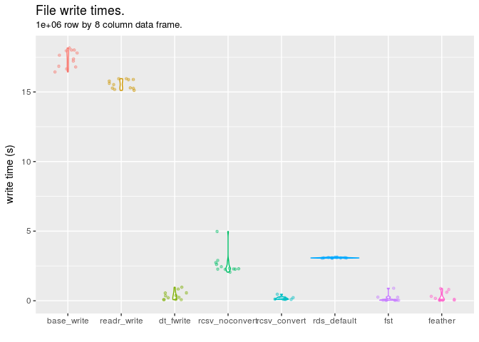
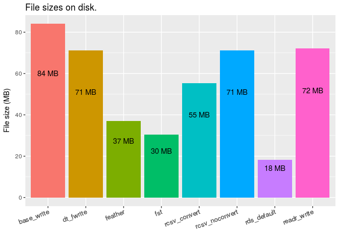

<!-- Do not edit README.md directly, edit README.Rmd instead and re-knit before commit -->
#### The rcsv format.

The basic idea behind this format is to add a header section to the regular csv format, containing information about the data frame being stored, in such a way as to allow easy reading and writing of data to and from file, without losing the structure of the original data. Specifically designed for storing data frame (or data table) objects, details stored in the header include the dimensions of the data frame, and the class of each column. This means that the data frame can be read back into memory when required, without the need to specify column classes on input, nor perform column manipulations after import. The data will be brought back into memory in (almost) exactly the form it was in when it was saved.

``` r
library( rcsv )
library( data.table )
library( dplyr )
library( readr )
library( ggplot2 )
```

#### Why not rds, feather, fst...?

Personally, I like to work with binary files, and not having to worry about things like classes, timezones, etc. However, these binary formats are often not suitable in certain workflows, for example where collaborators may not be working in R\*. It can also be beneficial in certain workflows to have meaningful diffs when a data file is changed, in order to work with version control systems like git.

So to make the data as generally accessible as possible, and allowing for meaningful diffs, while maintaining the ability to write out and read in data without losing important attributes, is the aim here.

-   `feather` tries to address this with compatibility in both R and python, but this still can't encompass everyone's collaborators.

#### Set up some test data

We'll look at a test data frame, using several different column types. The `rcsv` package is specifically designed to work with the following column types, while others may or may not work well (please do your own testing): character, numeric, integer, logical, factor, Date, POSIXct, ITime, IDate, times

``` r
testDF <- function( n ) {
    data.frame(
        integers = 1:n,
        letters = sample( letters, n, replace = TRUE ),
        dates = seq.Date( as.Date( "2000-01-01" ), by = 1, length.out = n ),
        posix = seq.POSIXt( as.POSIXct( "2000-01-01 10:00:00", tz = "EST" ), by = 1000, length.out = n ),
        itime = setattr( sample( seq_len( 86399 ), n, replace = TRUE ), "class", "ITime" ),
        logical = sample( c( TRUE, FALSE ), n, replace = T ),
        factor = factor( sample( c( "small", "medium", "large", "extra-large" ), n, replace = TRUE ),
                         levels = c( "small", "medium", "large", "extra-large" )  ),
        stringsAsFactors = FALSE
    )
}

set.seed( 123 )
df <- testDF( n = 100 )
glimpse( df, width = 80 )
#> Observations: 100
#> Variables: 7
#> $ integers <int> 1, 2, 3, 4, 5, 6, 7, 8, 9, 10, 11, 12, 13, 14, 15, 16, 17,...
#> $ letters  <chr> "h", "u", "k", "w", "y", "b", "n", "x", "o", "l", "y", "l"...
#> $ dates    <date> 2000-01-01, 2000-01-02, 2000-01-03, 2000-01-04, 2000-01-0...
#> $ posix    <dttm> 2000-01-01 10:00:00, 2000-01-01 10:16:40, 2000-01-01 10:3...
#> $ itime    <S3: ITime> 14:23:59, 07:59:16, 11:43:36, 22:54:26, 11:35:23, 21...
#> $ logical  <lgl> TRUE, FALSE, FALSE, FALSE, TRUE, FALSE, TRUE, TRUE, TRUE, ...
#> $ factor   <fctr> extra-large, small, extra-large, large, large, medium, sm...
```

#### write\_rcsv with default parameters

A simple call to `write_rcsv` will write out the object to csv as with any csv writing function.

``` r
testfile <- "READMEfiles/test.rcsv"
write_rcsv( df, testfile )
```

Note that at the top of this file though, is a (JSON-like) header:

``` r
readLines( testfile, n = 12 )
#>  [1] "#{rcsvHeader},{headlines:8},{colreflines:7},{tablerows:100}"                                         
#>  [2] "#{colref:1},{colname:integers},{colclass:integer}"                                                   
#>  [3] "#{colref:2},{colname:letters},{colclass:character}"                                                  
#>  [4] "#{colref:3},{colname:dates},{colclass:Date},{from:string}"                                           
#>  [5] "#{colref:4},{colname:posix},{colclass:POSIXct},{tz:EST},{from:string}"                               
#>  [6] "#{colref:5},{colname:itime},{colclass:ITime},{from:string}"                                          
#>  [7] "#{colref:6},{colname:logical},{colclass:logical},{from:long}"                                        
#>  [8] "#{colref:7},{colname:factor},{colclass:factor},{levels:small,medium,large,extra-large},{from:string}"
#>  [9] "integers,letters,dates,posix,itime,logical,factor"                                                   
#> [10] "1,h,2000-01-01,2000-01-01 10:00:00,14:23:59,TRUE,extra-large"                                        
#> [11] "2,u,2000-01-02,2000-01-01 10:16:40,07:59:16,FALSE,small"                                             
#> [12] "3,k,2000-01-03,2000-01-01 10:33:20,11:43:36,FALSE,extra-large"
```

The first line of the file contains some basic details about the file structure, below which is a series of lines specifying details of each column. This "header" section will be used by `read_rcsv` to import the data frame in a manner matching the file written out, without the need for special parameters on the read call, or additional manipulations after import.

``` r
df.readrcsv <- read_rcsv( testfile )
glimpse( df.readrcsv )
#> Observations: 100
#> Variables: 7
#> $ integers <int> 1, 2, 3, 4, 5, 6, 7, 8, 9, 10, 11, 12, 13, 14, 15, 16...
#> $ letters  <chr> "h", "u", "k", "w", "y", "b", "n", "x", "o", "l", "y"...
#> $ dates    <date> 2000-01-01, 2000-01-02, 2000-01-03, 2000-01-04, 2000...
#> $ posix    <dttm> 2000-01-01 10:00:00, 2000-01-01 10:16:40, 2000-01-01...
#> $ itime    <S3: ITime> 14:23:59, 07:59:16, 11:43:36, 22:54:26, 11:35:2...
#> $ logical  <lgl> TRUE, FALSE, FALSE, FALSE, TRUE, FALSE, TRUE, TRUE, T...
#> $ factor   <fctr> extra-large, small, extra-large, large, large, mediu...
```

All columns have been read in with identical column classes as the original test data frame.

Note that since the header section is designated by a \# at the beginning of each line. This means that any csv reader can still read the file, with "\#" passed as a comment character.

``` r
df.base <- read.csv( testfile, comment.char = "#" )
glimpse( df.base, width = 80 )
#> Observations: 100
#> Variables: 7
#> $ integers <int> 1, 2, 3, 4, 5, 6, 7, 8, 9, 10, 11, 12, 13, 14, 15, 16, 17,...
#> $ letters  <fctr> h, u, k, w, y, b, n, x, o, l, y, l, r, o, c, x, g, b, i, ...
#> $ dates    <fctr> 2000-01-01, 2000-01-02, 2000-01-03, 2000-01-04, 2000-01-0...
#> $ posix    <fctr> 2000-01-01 10:00:00, 2000-01-01 10:16:40, 2000-01-01 10:3...
#> $ itime    <fctr> 14:23:59, 07:59:16, 11:43:36, 22:54:26, 11:35:23, 21:22:0...
#> $ logical  <lgl> TRUE, FALSE, FALSE, FALSE, TRUE, FALSE, TRUE, TRUE, TRUE, ...
#> $ factor   <fctr> extra-large, small, extra-large, large, large, medium, sm...
```

Using a regular reader however, will not necessarily import the columns correctly. Even with the very good `readr` package, which does a great job, we won't always correctly attribute the original column classes, because there is ambiguity on the user's original intent.

``` r
df.readr <- readr::read_csv( testfile, comment = "#" )
glimpse( df.readr, width = 80 )
#> Observations: 100
#> Variables: 7
#> $ integers <int> 1, 2, 3, 4, 5, 6, 7, 8, 9, 10, 11, 12, 13, 14, 15, 16, 17,...
#> $ letters  <chr> "h", "u", "k", "w", "y", "b", "n", "x", "o", "l", "y", "l"...
#> $ dates    <date> 2000-01-01, 2000-01-02, 2000-01-03, 2000-01-04, 2000-01-0...
#> $ posix    <dttm> 2000-01-01 10:00:00, 2000-01-01 10:16:40, 2000-01-01 10:3...
#> $ itime    <time> 14:23:59, 07:59:16, 11:43:36, 22:54:26, 11:35:23, 21:22:0...
#> $ logical  <lgl> TRUE, FALSE, FALSE, FALSE, TRUE, FALSE, TRUE, TRUE, TRUE, ...
#> $ factor   <chr> "extra-large", "small", "extra-large", "large", "large", "...
```

Some of these issues will be easily fixed, like converting factors to strings, or vice-versa. Some are less simple though, for example timezones are generally\* not printed to csv files, meaning they are often read into memory with different timezone attributes from the original data frame. This can be difficult to notice if special care is not taken, and can have serious consequences. \*worth noting that `data.table::fwrite` does have a facility for this

``` r
cat( "from original data frame:\t", as.character( df$posix[1] ), attr( df$posix[1], "tzone" ), "\n" )
#> from original data frame:     2000-01-01 10:00:00 EST
cat( "using read_rcsv:\t\t", as.character( df.readrcsv$posix[1] ), attr( df.readrcsv$posix[1], "tzone" ), "\n" )
#> using read_rcsv:      2000-01-01 10:00:00 EST
cat( "using readr::read_csv:\t\t", as.character( df.readr$posix[1] ), attr( df.readr$posix[1], "tzone" ), "\n" )
#> using readr::read_csv:        2000-01-01 10:00:00 UTC
cat( "using base::read.csv:\t\t", as.character( df.base$posix[1] ), attr( df.base$posix[1], "tzone" ), "\n" )
#> using base::read.csv:         2000-01-01 10:00:00
```

`factor` columns also raise an issue here, where they may be correctly read in as factor, but associated incorrect levels, which may have consequences on further data analysis:

``` r
cat( "from original data frame:\t", levels( df$factor ), "\n" )
#> from original data frame:     small medium large extra-large
cat( "using read_rcsv:\t\t", levels( df.readrcsv$factor ), "\n" )
#> using read_rcsv:      small medium large extra-large
cat( "using readr::read_csv:\t\t", as.character( levels( df.readr$factor ) ), "\n" )
#> using readr::read_csv:       
cat( "using base::read.csv:\t\t", as.character( levels( df.base$factor ) ) )
#> using base::read.csv:         extra-large large medium small
```

`readr` defaults all columns without other conversion triggers to `character` class (hence there are no levels to display here). `read.csv` defaults these columns to `factor` class, but automatically sorts levels in alphabetical order, which may not be appropriate, as is the case here. `rcsv` determines whether or not to convert a column to factor based on the data frame from which it was written, and stores then extracts the correct factor levels order.

#### using write\_rcsv with data conversion options

The `write_rcsv` function includes several options for "compressing"" the csv output file by changing the way some columns are represented. We can control each conversion type individually with their respective parameters, or we can turn all of these options on with a single parameter, `strings.convert`.

``` r
rcsv::write_rcsv( df, testfile, strings.convert = TRUE )
readLines( testfile, n = 12 )
#>  [1] "#{rcsvHeader},{headlines:8},{colreflines:7},{tablerows:100}"                                                                      
#>  [2] "#{colref:1},{colname:integers},{colclass:integer}"                                                                                
#>  [3] "#{colref:2},{colname:letters},{colclass:character},{levels:a,b,c,d,e,f,g,h,i,j,k,l,m,n,o,p,q,r,s,t,u,v,w,x,y,z},{from:factorints}"
#>  [4] "#{colref:3},{colname:dates},{colclass:Date},{from:integer}"                                                                       
#>  [5] "#{colref:4},{colname:posix},{colclass:POSIXct},{tz:EST},{from:integer}"                                                           
#>  [6] "#{colref:5},{colname:itime},{colclass:ITime},{from:integer}"                                                                      
#>  [7] "#{colref:6},{colname:logical},{colclass:logical},{from:integer}"                                                                  
#>  [8] "#{colref:7},{colname:factor},{colclass:factor},{levels:small,medium,large,extra-large},{from:integer}"                            
#>  [9] "integers,letters,dates,posix,itime,logical,factor"                                                                                
#> [10] "1,8,10957,946738800,51839,1,4"                                                                                                    
#> [11] "2,21,10958,946739800,28756,0,1"                                                                                                   
#> [12] "3,11,10959,946740800,42216,0,4"
```

The data itself here looks significantly different from the regular csv. character strings, factors, dates, times, and logical objects are all being represented as integers, to be converted back to their respective classes on import using the information stored in the header, without any extra parameters needing to be passed to the import call:

``` r
df.readrcsv.convert <- read_rcsv( testfile )
glimpse( df.readrcsv.convert )
#> Observations: 100
#> Variables: 7
#> $ integers <int> 1, 2, 3, 4, 5, 6, 7, 8, 9, 10, 11, 12, 13, 14, 15, 16...
#> $ letters  <chr> "h", "u", "k", "w", "y", "b", "n", "x", "o", "l", "y"...
#> $ dates    <date> 2000-01-01, 2000-01-02, 2000-01-03, 2000-01-04, 2000...
#> $ posix    <dttm> 2000-01-01 10:00:00, 2000-01-01 10:16:40, 2000-01-01...
#> $ itime    <S3: ITime> 14:23:59, 07:59:16, 11:43:36, 22:54:26, 11:35:2...
#> $ logical  <lgl> TRUE, FALSE, FALSE, FALSE, TRUE, FALSE, TRUE, TRUE, T...
#> $ factor   <fctr> extra-large, small, extra-large, large, large, mediu...
```

#### File writing.

### Why use conversions?

By converting columns in this way, we may save disk space, as well as speed up reading and writing, while retaining the original data, and maintaining meaningful diffs. It is certainly less of a "general" data storage method (although the details needed to convert back to the original data types is mostly human-readable in the header, but I digress...) than without these conversions, but it may be useful in some situations.

To see the file size and speed advantages, we'll create a more meaningful (bigger) dataset, and write it to files with several different methods.

File write speeds
-----------------

``` r
n <- 1E5
df <- testDF( n )
write.times <- microbenchmark::microbenchmark(
    base.write = write.csv( df, "READMEfiles/base_write.csv" ),
    readr.write = readr::write_csv( df, "READMEfiles/readr_write.csv" ),
    dt.fwrite = data.table::fwrite( df, "READMEfiles/dt_fwrite.csv", dateTimeAs = "write.csv" ),
    rcsv.noconvert = rcsv::write_rcsv( df, "READMEfiles/rcsv_convert_FALSE.rcsv", strings.convert = FALSE ),
    rcsv.convert = rcsv::write_rcsv( df, "READMEfiles/rcsv_convert_TRUE.rcsv", strings.convert = TRUE ),
times = 4, control = list( warmup = 10 ) )
ggplot( write.times, aes( expr, time/1E9, colour = expr ) ) +
    geom_violin( show.legend = FALSE ) +
    geom_jitter( size = 1, alpha = 0.4, width = 0.25, show.legend = FALSE ) +
    ylab( "write time (s)" ) + xlab( "" ) +
    labs( title = "File write times.",
          subtitle = sprintf( "%s row by %s column data frame.", n, ncol( df ) ) )
```


`write_rcsv` is built around `data.table::fwrite`, so the speed differences between `dt.fwrite`, `rcsv.noconvert`, and `rcsv.convert` seen here are the result of additional processing in the `write_rcsv` function (slowing it down), and the advantage of writing fewer characters to file (speeding it up where `strings.convert` == TRUE). Without string conversions, for data frames of a reasonable size, `rcsv` generally writes with comparable speed to `readr` and `base`, while turning the string conversions on can make it even faster than `fwrite` (which was a big surprise to me!).

File sizes
----------

``` r
files <- list.files( path = "READMEfiles/", pattern = "*_", full.names = TRUE )
sizes <- file.info( files )$size

ggplot( data = data.frame( files = gsub( ".*\\/|\\..*", "", files ), size = sizes ),
        mapping = aes( files, sizes/1E6, fill = files ) ) +
    geom_col( show.legend = FALSE ) +
    labs( title = "File sizes on disk." ) +
    xlab( "" ) + ylab( "File size (MB)" ) +
    theme(axis.text.x = element_text(size = 10, angle = 20, hjust = 1)) +
    geom_text( aes( label = paste( signif( sizes/1E6, 2 ), "MB" ), y = 0.7 * sizes/1E6 ),
               position = position_dodge(0.9),
               vjust = 0
    )
```



Note most csv writers create files of similar sizes, but the `rcsv` format with string conversions can (in some circumstances) result in significant file size reductions.

File read times
---------------

``` r
read.times <- microbenchmark::microbenchmark(
    base.read = { df.base <- read.csv( "READMEfiles/base_write.csv" ) },
    readr.read = { df.readr <- readr::read_csv( "READMEfiles/readr_write.csv" ) },
    dt.fread = { df.fread <- data.table::fread( "READMEfiles/dt_fwrite.csv" ) },
    noconvert = { df.noconvert <- rcsv::read_rcsv( "READMEfiles/rcsv_convert_FALSE.rcsv" ) },
    convert = { df.convert <- rcsv::read_rcsv( "READMEfiles/rcsv_convert_TRUE.rcsv" ) },
times = 5, control = list( warmup = 10 ) )

ggplot( read.times, aes( expr, time/1E9, colour = expr ) ) +
    geom_violin( show.legend = FALSE ) +
    geom_jitter( size = 1, alpha = 0.4, width = 0.25, show.legend = FALSE ) +
    ylab( "read time (s)" ) + xlab( "" ) +
    scale_y_log10() +
    labs( title = "File read times (log10 y scale)",
          subtitle = sprintf( "%s row by %s column data frame.", n, ncol( df ) ) )
```



We can see here that when reading in data, the speed of `rcsv` is excellent if conversions are used, but slowed significantly without conversions (even slower than `base::read.csv`). Note the time spent here is on applying conversions to the data on import. These conversions would usually need to be performed manually after import, meaning that the slow speed here may not be the whole story, depending on your use case.

#### Testing that the data has been read in correctly.

Test for correct data read. We look at each column of each imported data frame, and compare it to the matching column in the original data frame. In this way, we see if the data has remained consistent through the write/read process.

Note: We use `all.equal` here, since `identical` seems too fussy in this case. I'm not sure why, but there often seems to be some invisible characteristics of some columns which cause `identical` to return FALSE, even though everything seems to be the same.

``` r
tests <- lapply( X = list( df.convert = df.convert,
                           df.noconvert = df.noconvert,
                           df.fread = df.fread,
                           df.base = df.base,
                           df.readr = df.readr ),
                 FUN = function(x) {
                     sapply( seq_along( df ),
                             function(i) all.equal( df[[i]], x[[i]] )
                     )
                 }
) %>%
    lapply( function(x) paste( x, collapse = " " ) )
print( tests )
#> $df.convert
#> [1] "TRUE TRUE TRUE TRUE TRUE TRUE TRUE"
#> 
#> $df.noconvert
#> [1] "TRUE TRUE TRUE TRUE TRUE TRUE TRUE"
#> 
#> $df.fread
#> [1] "TRUE TRUE c(\"Modes: numeric, character\", \"Attributes: < Modes: list, NULL >\", \"Attributes: < Lengths: 1, 0 >\", \"Attributes: < names for target but not for current >\", \"Attributes: < current is not list-like >\", \"target is Date, current is character\") Mean absolute difference: 98896.39 c(\"Modes: numeric, character\", \"Attributes: < Modes: list, NULL >\", \"Attributes: < Lengths: 1, 0 >\", \"Attributes: < names for target but not for current >\", \"Attributes: < current is not list-like >\", \"target is ITime, current is character\") TRUE 'current' is not a factor"
#> 
#> $df.base
#> [1] "TRUE c(\"Modes: character, numeric\", \"target is character, current is numeric\") c(\"Attributes: < Length mismatch: comparison on first 1 components >\", \"Attributes: < Component \\\"class\\\": 1 string mismatch >\", \"target is Date, current is factor\") Mean absolute difference: 4269865514 c(\"Attributes: < Length mismatch: comparison on first 1 components >\", \"Attributes: < Component \\\"class\\\": 1 string mismatch >\", \"target is ITime, current is factor\") c(\"Modes: logical, numeric\", \"Attributes: < target is NULL, current is list >\", \"target is logical, current is factor\") 'current' is not a factor"
#> 
#> $df.readr
#> [1] "TRUE TRUE TRUE TRUE c(\"Attributes: < Length mismatch: comparison on first 1 components >\", \"Attributes: < Component \\\"class\\\": Lengths (1, 2) differ (string compare on first 1) >\", \"Attributes: < Component \\\"class\\\": 1 string mismatch >\", \"target is ITime, current is hms\") TRUE 'current' is not a factor"
```

It's clear here that imports using regular csv readers will need some work to bring the data back to the way it should be. This manipulation needs to be repeated every time a dataset is read into memory, which can be quite prohibitive to a smooth workflow. With `rcsv`, the data is read back into R in the same form as before it was written out, with no additional time or effort on the part of the user.

#### Notes, an added detail to your datasets

Sometimes it's important to include a few brief notes with your dataset. Maybe the specs for a piece of equipment used to collect the data, or maybe something that a user of the dataset should be aware of when working with it. The `rcsv` format has this facility built in. You can add a note to your data frame, which is stored as an attribute named `notes`.

``` r
df <- testDF( 100 )
notes_add( df, "here's the first note for this dataset" )
#> Note:  here's the first note for this dataset
```

This note can be replaced, by using `notes_replace`, or we can add another note with `notes_add`

``` r
notes_add( df, "this is my second note. I might add more later." )
#> Note:  here's the first note for this dataset
#>  this is my second note. I might add more later.
```

Each time a note is added, the full set of notes are printed to the console. This console print will also happen whenever the data is written to file...

``` r
write_rcsv( df, testfile )
#> Notes:  here's the first note for this dataset
#>  this is my second note. I might add more later.
```

And whenever it is read from file.

``` r
df <- read_rcsv( testfile )
#> Notes:  here's the first note for this dataset
#>  this is my second note. I might add more later.
```

These notes are stored in the file header in a human-readable way, meaning that they can be accessed even without the `rcsv` package.

``` r
readLines( testfile, 3 )
#> [1] "#{rcsvHeader},{headlines:10},{noteslines:2},{colreflines:7},{tablerows:100}"
#> [2] "#{notes:here's the first note for this dataset}"                            
#> [3] "#{notes:this is my second note. I might add more later.}"
```

#### Helper functions

The `rcsv` package also includes several helper functions to work with rcsv files, without loading the entire dataset into memory. These functions are therefore very fast ways to access details on even very large data files.

glimpse\_rcsv
-------------

`glimpse_rcsv` displays a `dplyr::glimpse`-like view of the data, without loading the entire dataset into memory.

``` r
glimpse_rcsv( testfile )
#> Notes:  here's the first note for this dataset
#>  this is my second note. I might add more later.
#> 
#>  "integers" <int> 1,2,3,4,5,6,7,8,9,10,11,12,13,14,15,16,17,18,19,20,21...
#>  "letters" <char> h,h,m,a,n,u,j,j,h,z,n,i,k,t,w,t,c,w,a,e,n...
#>  "dates" <date> 2000-01-01,2000-01-02,2000-01-03,2000-01-04,2000-01-05,2000-01-0...
#>  "posix" <posx> 2000-01-01 10:00:00,2000-01-01 10:16:40,2000-01-01 10:33:20,2000...
#>  "itime" <itim> 08:34:09,00:33:38,18:39:31,09:56:44,12:27:29,09:48:41,04:45:31,2...
#>  "logical" <logi> FALSE,TRUE,TRUE,TRUE,FALSE,TRUE,FALSE,TRUE,TRUE,FALSE,FALSE,FALS...
#>  "factor" <fct> extra-large,extra-large,small,large,large,medium,large,medium,sm...
```

dim\_rcsv
---------

`dim_rcsv` returns the dimensions of the given dataset as a named vector, without loading the dataset itself.

``` r
dim_rcsv( testfile )
#> rows cols 
#>  100    9
```

names\_rcsv
-----------

`names_rcsv` returns the column names, without loading the dataset.

``` r
names_rcsv( testfile )
#> [1] "integers" "letters"  "dates"    "posix"    "itime"    "logical" 
#> [7] "factor"
```

classes\_rcsv
-------------

`classes_rcsv` returns the column classes as a named vector (column names are vector names), without loading the dataset.

``` r
classes_rcsv( testfile )
#>    integers     letters       dates       posix       itime     logical 
#>   "integer" "character"      "Date"   "POSIXct"     "ITime"   "logical" 
#>      factor 
#>    "factor"
```

notes\_rcsv
-----------

`notes_rcsv` returns only the notes associated with a data file, without loading the dataset.

``` r
notes_rcsv( testfile )
#> Note:  here's the first note for this dataset
#>  this is my second note. I might add more later.
```
