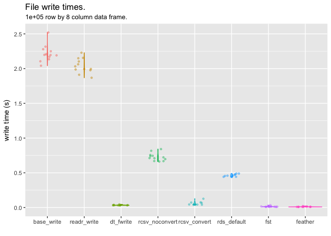

<!-- Do not edit README.md directly, edit README.Rmd instead and re-knit before commit -->
The rcsv format.
----------------

The basic idea behind this format is to add a header section to the regular csv format, containing information about the data frame being stored, in such a way as to allow easy reading and writing of data to and from file, without losing the structure of the original data. Specifically designed for storing data frame (or data table) objects, details stored in the header include the dimensions of the data frame, and the class of each column. This means that the data frame can be read back into memory when required, without the need to specify column classes on input, nor perform column manipulations after import. The data will be brought back into memory in (almost) exactly the form it was in when it was saved.

``` r
library( rcsv )
library( data.table )
library( dplyr )
library( readr )
library( ggplot2 )
```

Why not rds, feather, fst...?
-----------------------------

Personally, I like to work with binary files, and not having to worry about things like classes, timezones, etc. However, these binary formats are often not suitable in certain workflows, for example where collaborators may not be working in R\*. It can also be beneficial in certain workflows to have meaningful diffs when a data file is changed, in order to work with version control systems like git.

So to make the data as generally accessible as possible, and allowing for meaningful diffs, while maintaining the ability to write out and read in data without losing important attributes, is the aim here.

-   `feather` tries to address this with compatibility in both R and python, but this still can't encompass everyone's collaborators.

Testing
-------

### Set up some test data

We'll look at a test data frame, using several different column types. The `rcsv` package is specifically designed to work with the following column types, while others may or may not work well (please do your own testing): character, numeric, integer, logical, factor, Date, POSIXct, ITime, IDate, times

``` r
testDF <- function( n ) {
    data.frame(
        integers = 1:n,
        letters = sample( letters, n, replace = TRUE ),
        dates = seq.Date( as.Date( "2000-01-01" ), by = 1, length.out = n ),
        posix = seq.POSIXt( as.POSIXct( "2000-01-01 10:00:00", tz = "EST" ), by = 1000, length.out = n ),
        itime = setattr( sample( seq_len( 86399 ), n, replace = TRUE ), "class", "ITime" ),
        logical = sample( c( TRUE, FALSE ), n, replace = T ),
        factor = factor( sample( c( "small", "medium", "large", "extra-large" ), n, replace = TRUE ),
                         levels = c( "small", "medium", "large", "extra-large" )  ),
        times = chron::times( seq.int( from = 0.001, to = 0.999, length.out = n ) ),
        stringsAsFactors = FALSE
    )
}

set.seed( 123 )
df <- testDF( n = 100 )
glimpse( df, width = 80 )
#> Observations: 100
#> Variables: 8
#> $ integers <int> 1, 2, 3, 4, 5, 6, 7, 8, 9, 10, 11, 12, 13, 14, 15, 16, 17,...
#> $ letters  <chr> "h", "u", "k", "w", "y", "b", "n", "x", "o", "l", "y", "l"...
#> $ dates    <date> 2000-01-01, 2000-01-02, 2000-01-03, 2000-01-04, 2000-01-0...
#> $ posix    <dttm> 2000-01-01 10:00:00, 2000-01-01 10:16:40, 2000-01-01 10:3...
#> $ itime    <S3: ITime> 14:23:59, 07:59:16, 11:43:36, 22:54:26, 11:35:23, 21...
#> $ logical  <lgl> TRUE, FALSE, FALSE, FALSE, TRUE, FALSE, TRUE, TRUE, TRUE, ...
#> $ factor   <fctr> extra-large, small, extra-large, large, large, medium, sm...
#> $ times    <S3: times> 00:01:26, 00:15:57, 00:30:28, 00:44:59, 00:59:30, 01...
```

### write\_rcsv with default parameters

A simple call to `write_rcsv` will write out the object to csv as with any csv writing function.

``` r
testfile <- "READMEfiles/test.rcsv"
write_rcsv( df, testfile )
```

Note that at the top of this file though, is a (JSON-like) header:

``` r
readLines( testfile, n = 12 )
#>  [1] "#{rcsvHeader},{headlines:9},{colreflines:8},{tablerows:100}"                                         
#>  [2] "#{colref:1},{colname:integers},{colclass:integer}"                                                   
#>  [3] "#{colref:2},{colname:letters},{colclass:character}"                                                  
#>  [4] "#{colref:3},{colname:dates},{colclass:Date},{from:string}"                                           
#>  [5] "#{colref:4},{colname:posix},{colclass:POSIXct},{tz:EST},{from:string}"                               
#>  [6] "#{colref:5},{colname:itime},{colclass:ITime},{from:string}"                                          
#>  [7] "#{colref:6},{colname:logical},{colclass:logical},{from:long}"                                        
#>  [8] "#{colref:7},{colname:factor},{colclass:factor},{levels:small,medium,large,extra-large},{from:string}"
#>  [9] "#{colref:8},{colname:times},{colclass:times},{from:string}"                                          
#> [10] "integers,letters,dates,posix,itime,logical,factor,times"                                             
#> [11] "1,h,2000-01-01,2000-01-01 10:00:00,14:23:59,TRUE,extra-large,00:01:26"                               
#> [12] "2,u,2000-01-02,2000-01-01 10:16:40,07:59:16,FALSE,small,00:15:57"
```

The first line of the file contains some basic details about the file structure, below which is a series of lines specifying details of each column. This "header" section will be used by `read_rcsv` to import the data frame in a manner matching the file written out, without the need for special parameters on the read call, or additional manipulations after import.

``` r
df.readrcsv <- read_rcsv( testfile )
glimpse( df.readrcsv )
#> Observations: 100
#> Variables: 8
#> $ integers <int> 1, 2, 3, 4, 5, 6, 7, 8, 9, 10, 11, 12, 13, 14, 15, 16...
#> $ letters  <chr> "h", "u", "k", "w", "y", "b", "n", "x", "o", "l", "y"...
#> $ dates    <date> 2000-01-01, 2000-01-02, 2000-01-03, 2000-01-04, 2000...
#> $ posix    <dttm> 2000-01-01 05:00:00, 2000-01-01 05:16:40, 2000-01-01...
#> $ itime    <S3: ITime> 14:23:59, 07:59:16, 11:43:36, 22:54:26, 11:35:2...
#> $ logical  <lgl> TRUE, FALSE, FALSE, FALSE, TRUE, FALSE, TRUE, TRUE, T...
#> $ factor   <fctr> extra-large, small, extra-large, large, large, mediu...
#> $ times    <S3: times> 00:01:26, 00:15:57, 00:30:28, 00:44:59, 00:59:3...
```

All columns have been read in with identical column classes as the original test data frame.

Note that since the header section is designated by a \# at the beginning of each line. This means that any csv reader can still read the file, with "\#" passed as a comment character.

``` r
df.base <- read.csv( testfile, comment.char = "#" )
glimpse( df.base, width = 80 )
#> Observations: 100
#> Variables: 8
#> $ integers <int> 1, 2, 3, 4, 5, 6, 7, 8, 9, 10, 11, 12, 13, 14, 15, 16, 17,...
#> $ letters  <fctr> h, u, k, w, y, b, n, x, o, l, y, l, r, o, c, x, g, b, i, ...
#> $ dates    <fctr> 2000-01-01, 2000-01-02, 2000-01-03, 2000-01-04, 2000-01-0...
#> $ posix    <fctr> 2000-01-01 10:00:00, 2000-01-01 10:16:40, 2000-01-01 10:3...
#> $ itime    <fctr> 14:23:59, 07:59:16, 11:43:36, 22:54:26, 11:35:23, 21:22:0...
#> $ logical  <lgl> TRUE, FALSE, FALSE, FALSE, TRUE, FALSE, TRUE, TRUE, TRUE, ...
#> $ factor   <fctr> extra-large, small, extra-large, large, large, medium, sm...
#> $ times    <fctr> 00:01:26, 00:15:57, 00:30:28, 00:44:59, 00:59:30, 01:14:0...
```

Using a regular reader however, will not necessarily import the columns correctly (note several incorrect import formats above). Even with the very good `readr` package, which does a great job, we won't always correctly attribute the original column classes, because there is ambiguity on the user's original intent.

``` r
df.readr <- readr::read_csv( testfile, comment = "#" )
glimpse( df.readr, width = 80 )
#> Observations: 100
#> Variables: 8
#> $ integers <int> 1, 2, 3, 4, 5, 6, 7, 8, 9, 10, 11, 12, 13, 14, 15, 16, 17,...
#> $ letters  <chr> "h", "u", "k", "w", "y", "b", "n", "x", "o", "l", "y", "l"...
#> $ dates    <date> 2000-01-01, 2000-01-02, 2000-01-03, 2000-01-04, 2000-01-0...
#> $ posix    <dttm> 2000-01-01 10:00:00, 2000-01-01 10:16:40, 2000-01-01 10:3...
#> $ itime    <time> 14:23:59, 07:59:16, 11:43:36, 22:54:26, 11:35:23, 21:22:0...
#> $ logical  <lgl> TRUE, FALSE, FALSE, FALSE, TRUE, FALSE, TRUE, TRUE, TRUE, ...
#> $ factor   <chr> "extra-large", "small", "extra-large", "large", "large", "...
#> $ times    <time> 00:01:26, 00:15:57, 00:30:28, 00:44:59, 00:59:30, 01:14:0...
```

Some of these issues will be easily fixed, like converting factors to strings, or vice-versa. Some are less simple though, for example timezones are generally\* not printed to csv files, meaning they are often read into memory with different timezone attributes from the original data frame. This can be difficult to notice if special care is not taken, and can have serious consequences. \*worth noting that `data.table::fwrite` does have a facility for this

``` r
cat( "Testing for timezone changes:\n",
     "from original data frame:\t", as.character( df$posix[1] ), attr( df$posix[1], "tzone" ), "\n",
     "using read_rcsv:\t\t", as.character( df.readrcsv$posix[1] ), attr( df.readrcsv$posix[1], "tzone" ), "\n",
     "using readr::read_csv:\t\t", as.character( df.readr$posix[1] ), attr( df.readr$posix[1], "tzone" ), "\n",
     "using base::read.csv:\t\t", as.character( df.base$posix[1] ), attr( df.base$posix[1], "tzone" ), "\n" )
#> Testing for timezone changes:
#>  from original data frame:    2000-01-01 10:00:00 EST 
#>  using read_rcsv:         2000-01-01 05:00:00 EST 
#>  using readr::read_csv:       2000-01-01 10:00:00 UTC 
#>  using base::read.csv:        2000-01-01 10:00:00
```

`factor` columns also raise an issue here, where they may be correctly read in as factor, but associated incorrect levels, which may have consequences on further data analysis:

``` r
cat( "Testing for factor level changes:\n",
     "from original data frame:\t", levels( df$factor ), "\n",
     "using read_rcsv:\t\t", levels( df.readrcsv$factor ), "\n",
     "using readr::read_csv:\t\t", levels( df.readr$factor ), "\n",
     "using base::read.csv:\t\t", levels( df.base$factor ) )
#> Testing for factor level changes:
#>  from original data frame:    small medium large extra-large 
#>  using read_rcsv:         small medium large extra-large 
#>  using readr::read_csv:       
#>  using base::read.csv:        extra-large large medium small
```

`readr` defaults all columns without other conversion triggers to `character` class (hence there are no levels to display here). `read.csv` defaults these columns to `factor` class, but automatically sorts levels in alphabetical order, which may not be appropriate, as is the case here. `rcsv` determines whether or not to convert a column to factor based on the data frame from which it was written, and stores then extracts the correct factor levels, including their order.

### using write\_rcsv with data conversion options

The `write_rcsv` function includes several options for "compressing" the csv output file by changing the way some columns are represented. We can control each conversion type individually with their respective parameters, or we can turn all of these options on with a single parameter, `strings.convert`.

``` r
rcsv::write_rcsv( df, testfile, strings.convert = TRUE )
readLines( testfile, n = 12 )
#>  [1] "#{rcsvHeader},{headlines:9},{colreflines:8},{tablerows:100}"                                                                      
#>  [2] "#{colref:1},{colname:integers},{colclass:integer}"                                                                                
#>  [3] "#{colref:2},{colname:letters},{colclass:character},{levels:a,b,c,d,e,f,g,h,i,j,k,l,m,n,o,p,q,r,s,t,u,v,w,x,y,z},{from:factorints}"
#>  [4] "#{colref:3},{colname:dates},{colclass:Date},{from:integer}"                                                                       
#>  [5] "#{colref:4},{colname:posix},{colclass:POSIXct},{tz:EST},{from:integer}"                                                           
#>  [6] "#{colref:5},{colname:itime},{colclass:ITime},{from:integer}"                                                                      
#>  [7] "#{colref:6},{colname:logical},{colclass:logical},{from:integer}"                                                                  
#>  [8] "#{colref:7},{colname:factor},{colclass:factor},{levels:small,medium,large,extra-large},{from:integer}"                            
#>  [9] "#{colref:8},{colname:times},{colclass:times},{from:numeric}"                                                                      
#> [10] "integers,letters,dates,posix,itime,logical,factor,times"                                                                          
#> [11] "1,8,10957,946738800,51839,1,4,0.001"                                                                                              
#> [12] "2,21,10958,946739800,28756,0,1,0.0110808080808081"
```

The data itself here looks significantly different from the regular csv. character strings, factors, dates, times, and logical objects are all being represented in integer or numeric form, to be converted back to their respective classes on import using the information stored in the header, without any extra parameters needing to be passed to the import call:

``` r
df.readrcsv.convert <- read_rcsv( testfile )
glimpse( df.readrcsv.convert )
#> Observations: 100
#> Variables: 8
#> $ integers <int> 1, 2, 3, 4, 5, 6, 7, 8, 9, 10, 11, 12, 13, 14, 15, 16...
#> $ letters  <chr> "h", "u", "k", "w", "y", "b", "n", "x", "o", "l", "y"...
#> $ dates    <date> 2000-01-01, 2000-01-02, 2000-01-03, 2000-01-04, 2000...
#> $ posix    <dttm> 2000-01-01 10:00:00, 2000-01-01 10:16:40, 2000-01-01...
#> $ itime    <S3: ITime> 14:23:59, 07:59:16, 11:43:36, 22:54:26, 11:35:2...
#> $ logical  <lgl> TRUE, FALSE, FALSE, FALSE, TRUE, FALSE, TRUE, TRUE, T...
#> $ factor   <fctr> extra-large, small, extra-large, large, large, mediu...
#> $ times    <S3: times> 00:01:26, 00:15:57, 00:30:28, 00:44:59, 00:59:3...
```

File writing.
-------------

### Why use conversions?

By converting columns in this way, we may save disk space\*, as well as speed up reading and writing, while retaining the original data, and maintaining meaningful diffs. It is certainly less of a "general" data storage method (although the details needed to convert back to the original data types is mostly human-readable in the header, but I digress...) than without these conversions, but it may be useful in some situations.

To see the file size and speed advantages, we'll create a more meaningful (bigger) dataset, and write it to files with several different methods.

-   Character columns with highly repeated string fields will benefit greatly, whereas those with completely unique string fields will not. `Date`, `ITime`, and `IDate` formats are all more efficiently stored as integers than character strings, and will generally convert to their proper classes faster from integers than from character strings. `POSIXct` is likewise more efficiently converted from numeric, and this also makes storage of greater precision than 1s simpler and more efficient. Similarly, `times` format values stored as numeric enables greater than 1s precision values to be stored and retrieved, however in some cases may increase storage size (where the decimal values convert to longer strings than the formatted time value).

### File write speeds

We test the speed of file writing between a few of the methods available to an R user. Note that we include lots of methods in the test runs, but will only plot results from `data.table` and `rcsv`. This is because `base` and `readr` are too much slower, while `fst` and `feather` are too much faster, such that the plot doesn't

``` r
n <- 1E6
df <- testDF( n )
write.times <- microbenchmark::microbenchmark(
    base_write = write.csv( df, "READMEfiles/base_write.csv" ),
    readr_write = readr::write_csv( df, "READMEfiles/readr_write.csv" ),
    dt_fwrite = data.table::fwrite( df, "READMEfiles/dt_fwrite.csv" ),
    rcsv_noconvert = rcsv::write_rcsv( df, "READMEfiles/rcsv_noconvert.rcsv" ),
    rcsv_convert = rcsv::write_rcsv( df, "READMEfiles/rcsv_convert.rcsv", strings.convert = TRUE ),
    rds_default = saveRDS( df, "READMEfiles/rds_default.rds" ),
    fst = fst::write.fst( df, "READMEfiles/fst.fst" ),
    feather = feather::write_feather( df, "READMEfiles/feather.feather" ),
    times = 12
)
#> 
Written 43.6% of 1000000 rows in 5 secs using 8 threads. anyBufferGrown=no; maxBuffUsed=46%. Finished in 6 secs.      
                                                                                                                                     

Written 38.1% of 1000000 rows in 2 secs using 8 threads. anyBufferGrown=no; maxBuffUsed=46%. Finished in 3 secs.      
                                                                                                                                     

Written 27.2% of 1000000 rows in 3 secs using 8 threads. anyBufferGrown=no; maxBuffUsed=46%. Finished in 8 secs.      
                                                                                                                                     

Written 5.4% of 1000000 rows in 2 secs using 8 threads. anyBufferGrown=no; maxBuffUsed=45%. Finished in 34 secs.      
                                                                                                                                     

Written 32.7% of 1000000 rows in 2 secs using 8 threads. anyBufferGrown=no; maxBuffUsed=46%. Finished in 4 secs.      
                                                                                                                                     

Written 32.7% of 1000000 rows in 2 secs using 8 threads. anyBufferGrown=no; maxBuffUsed=46%. Finished in 4 secs.      
                                                                                                                                     

Written 5.4% of 1000000 rows in 2 secs using 8 threads. anyBufferGrown=no; maxBuffUsed=45%. Finished in 34 secs.      
                                                                                                                                     

Written 21.8% of 1000000 rows in 2 secs using 8 threads. anyBufferGrown=no; maxBuffUsed=46%. Finished in 7 secs.      
                                                                                                                                     

Written 10.9% of 1000000 rows in 2 secs using 8 threads. anyBufferGrown=no; maxBuffUsed=45%. Finished in 16 secs.      
                                                                                                                                     

Written 5.4% of 1000000 rows in 2 secs using 8 threads. anyBufferGrown=no; maxBuffUsed=45%. Finished in 34 secs.      
                                                                                                                                     

Written 16.3% of 1000000 rows in 2 secs using 8 threads. anyBufferGrown=no; maxBuffUsed=46%. Finished in 10 secs.      
                                                                                                                                     

Written 38.1% of 1000000 rows in 2 secs using 8 threads. anyBufferGrown=no; maxBuffUsed=46%. Finished in 3 secs.      
                                                                                                                                     
write.times
#> Unit: milliseconds
#>            expr         min          lq       mean      median         uq
#>      base_write 16438.05911 16822.33967 17408.7482 17506.74187 17981.8812
#>     readr_write 15115.65891 15271.42986 15561.7886 15572.96949 15888.2406
#>       dt_fwrite    73.22938    88.50422   370.1842   300.63675   560.0786
#>  rcsv_noconvert  2054.16972  2269.22320  2617.6383  2309.97661  2673.2302
#>    rcsv_convert    93.15866   104.54060   176.6040   126.56123   221.0548
#>     rds_default  3056.46976  3071.43346  3089.0495  3078.99488  3104.6503
#>             fst    32.55602    33.83868   150.8507    35.11388   177.4708
#>         feather    44.49982    45.03265   262.5553    74.47985   462.7075
#>         max neval
#>  18157.5345    12
#>  15952.4157    12
#>    967.5374    12
#>   4973.3361    12
#>    465.9984    12
#>   3134.7373    12
#>    897.9506    12
#>    874.9755    12
```

`write_rcsv` is built around the fantastic `data.table::fwrite` function, making it much faster than both `base::write.csv` and `readr::write_csv`. It even maintains relatively good performance compared with `data.table::fwrite`, but is slowed a little by the conversion processes and header writing steps.

``` r
ggplot( write.times,
        mapping = aes( expr, time/1E9, colour = expr ) ) +
    geom_violin( show.legend = FALSE ) +
    geom_jitter( size = 1, alpha = 0.4, width = 0.25, show.legend = FALSE ) +
    ylab( "write time (s)" ) + xlab( "" ) +
    ylim( c( 0, NA ) ) +
    labs( title = "File write times.",
          subtitle = sprintf( "%s row by %s column data frame.", n, ncol( df ) ) )
```


The speed differences between `dt.fwrite`, `rcsv.noconvert`, and `rcsv.convert` seen here are the result of additional processing in the `write_rcsv` function (slowing it down), and the advantage of writing fewer characters to file (speeding it up where `strings.convert` == TRUE). Without string conversions, `rcsv` generally writes with comparable speed to `saveRDS`, while turning the string conversions on can make it significantly faster.

### File sizes

``` r
files <- list.files( path = "READMEfiles/", full.names = TRUE )
files <- files[ !grepl( "test.rcsv", files ) ]
sizes <- file.info( files )$size

ggplot( data = data.frame( files = gsub( ".*\\/|\\..*", "", files ), size = sizes ),
        mapping = aes( files, sizes/1E6, fill = files ) ) +
    geom_col( show.legend = FALSE ) +
    labs( title = "File sizes on disk." ) +
    xlab( "" ) + ylab( "File size (MB)" ) +
    theme(axis.text.x = element_text(size = 10, angle = 20, hjust = 1)) +
    geom_text( aes( label = paste( signif( sizes/1E6, 2 ), "MB" ), y = 0.7 * sizes/1E6 ),
               position = position_dodge(0.9),
               vjust = 0
    )
```


Note most csv writers create files of similar sizes, but the `rcsv` format with string conversions can (in some circumstances) result in significant file size reductions. We do not have the same file size benefit of the compressed (as per default settings) `rds` format, so if file size is of paramount importance, it may be worth sticking with the rds format, or including an extra file compression step to your workflow; that is not the primary concern here though.

### File read times

``` r
read.times <- microbenchmark::microbenchmark(
    base_read = { df.base <- read.csv( "READMEfiles/base_write.csv" ) },
    readr_read = { df.readr <- readr::read_csv( "READMEfiles/readr_write.csv" ) },
    dt_fread = { df.fread <- data.table::fread( "READMEfiles/dt_fwrite.csv" ) },
    rcsv_noconvert = { df.noconvert <- rcsv::read_rcsv( "READMEfiles/rcsv_noconvert.rcsv" ) },
    rcsv_convert = { df.convert <- rcsv::read_rcsv( "READMEfiles/rcsv_convert.rcsv" ) },
    rds_default = { df.rds <- readRDS( "READMEfiles/rds_default.rds" ) },
    fst = { df.fst <- fst::read.fst( "READMEfiles/fst.fst" ) },
    feather = { df.feather <- feather::read_feather( "READMEfiles/feather.feather" ) },
    times = 12
)
read.times
#> Unit: milliseconds
#>            expr        min         lq       mean     median        uq
#>       base_read 5862.51248 5892.86764 6082.20394 6084.49005 6193.4126
#>      readr_read 1167.56787 1187.34109 1272.97911 1277.82166 1300.3623
#>        dt_fread  637.31915  649.50794  680.74756  684.03657  694.1507
#>  rcsv_noconvert 2323.62187 2459.83549 2688.32792 2664.28305 2930.6322
#>    rcsv_convert  696.49800  810.00419  974.36161  887.06527 1195.6705
#>     rds_default  326.54951  333.05116  370.31596  337.41771  400.9823
#>             fst   26.60566   27.25072   86.54616   30.36329  136.2420
#>         feather   28.24911   28.51047  155.60958   36.91170  364.1190
#>        max neval
#>  6407.0256    12
#>  1535.4889    12
#>   781.4978    12
#>  3060.8552    12
#>  1352.6324    12
#>   491.4893    12
#>   381.6507    12
#>   465.8959    12
```

``` r
ggplot( data = read.times, #setDT( read.times )[ grepl( "^rcsv|^dt|^rds|^fst|^feather", expr ) ], 
        mapping = aes( expr, time/1E9, colour = expr ) ) +
    geom_violin( show.legend = FALSE ) +
    geom_jitter( size = 1, alpha = 0.4, width = 0.25, show.legend = FALSE ) +
    ylab( "read time (s)" ) + xlab( "" ) +
    ylim( c( 0, NA ) ) +
    labs( title = "File read times.",
          subtitle = sprintf( "%s row by %s column data frame.", n, ncol( df ) ) )
```


We can see here that when reading in data, the speed of `rcsv` is good if conversions are used, but slowed significantly without conversions (even slower than `base::read.csv`). Note the time spent here is on applying conversions to the data on import. These conversions would usually need to be performed manually after import, meaning that a more appropriate comparison between both forms of `read_rcsv` and other read methods may be to include those conversion steps

``` r
read.times.with.manipulations <- microbenchmark::microbenchmark(
    base_read = {
        df.base <- read.csv( "READMEfiles/base_write.csv" )
    },
    readr_read = {
        df.readr <- readr::read_csv( "READMEfiles/readr_write.csv",
                                     col_types = cols(
                                         col_integer(),
                                         col_character(),
                                         col_date(),
                                         col_character(),
                                         col_time(),
                                         col_logical(),
                                         col_factor(
                                             levels = c( "small", "medium", "large", "extra-large" )
                                         ),
                                         col_time()
                                     ) ) %>%
            mutate( posix = as.POSIXct( posix, origin = "1970-01-01 00:00:00", tz = "EST" ) )
        },
    dt_fread = { 
        df.fread.manip <- data.table::fread( "READMEfiles/dt_fwrite.csv" )
        df.fread.manip[ , dates := as.Date( dates ) ]
        df.fread.manip[ , posix := as.POSIXct( posix, origin = "1970-01-01 00:00:00", tz = "EST" ) ]
        df.fread.manip[ , itime := as.ITime( itime ) ]
        df.fread.manip[ , factor := factor( factor, levels = c( "small", "medium", "large", "extra-large" ) ) ]
        df.fread.manip[ , times := chron::times( times ) ] },
    rcsv_noconvert = { df.noconvert <- rcsv::read_rcsv( "READMEfiles/rcsv_noconvert.rcsv" ) },
    rcsv_convert = { df.convert <- rcsv::read_rcsv( "READMEfiles/rcsv_convert.rcsv" ) },
    rds_default = { df.rds <- readRDS( "READMEfiles/rds_default.rds" ) },
    fst = { df.fst <- fst::read.fst( "READMEfiles/fst.fst" ) },
    feather = { df.feather <- feather::read_feather( "READMEfiles/feather.feather" ) },
    times = 12
)
read.times.with.manipulations
#> Unit: milliseconds
#>            expr        min         lq       mean     median         uq
#>       base_read 5870.73964 6023.19463 6196.97127 6185.86476 6331.51853
#>      readr_read 4691.66823 4766.09059 5279.12474 5433.99795 5684.36228
#>        dt_fread 5741.65026 5891.73258 6125.45770 6053.93146 6373.14438
#>  rcsv_noconvert 2235.79692 2731.90316 2918.38104 2831.06168 3120.04830
#>    rcsv_convert  705.14363  714.94542  828.44038  871.59043  876.77988
#>     rds_default  330.93764  333.00957  343.54049  333.93755  336.74724
#>             fst   26.35359   27.17547   57.99249   28.20860   79.69119
#>         feather   27.64031   28.64696   56.87880   29.63069   32.83938
#>        max neval
#>  6669.4661    12
#>  5953.1999    12
#>  6619.0039    12
#>  3670.3827    12
#>   991.7617    12
#>   443.9374    12
#>   186.4455    12
#>   195.9820    12
```

``` r
ggplot( setDT( read.times.with.manipulations )[ grepl( "^base|^readr|^rcsv|^dt", expr ) ],
        mapping = aes( expr, time/1E9, colour = expr ) ) +
    geom_violin( show.legend = FALSE ) +
    geom_jitter( size = 1, alpha = 0.4, width = 0.25, show.legend = FALSE ) +
    ylab( "read time (s)" ) + xlab( "" ) +
    ylim( c( 0, NA ) ) +
    labs( title = "File read times, with column manipulations where necessary.",
          subtitle = sprintf( "%s row by %s column data frame.", n, ncol( df ) ) )
```



So, assuming you'll be performing the necessary data conversions on import, `fread` is actually significantly slower than `rcsv`. In the case of `rcsv_convert`, this is due to the fact that converting from numeric variables is often faster than from character. In the case of `rcsv_noconvert`, it is largely due to the use of the `fasttime` package in converting Date and POSIXct variables, which offers significant speed improvements over `as.Date` and `as.POSIXct` functions.

Data integrity
--------------

### Testing that the data has been read in correctly.

To test for correct data read, ee look at each column of each imported data frame, and compare it to the matching column in the original data frame. In this way, we see if the data has remained consistent through the write/read process.

Note: We use `all.equal` here, since `identical` seems too fussy in this case. I'm not sure why, but there often seems to be some invisible characteristics of some columns which cause `identical` to return FALSE, even though everything seems to be the same.

``` r
tests <- lapply( X = list( df.convert = df.convert,
                           df.noconvert = df.noconvert,
                           # df.fread = df.fread,
                           df.fread.manip = df.fread.manip,
                           df.base = df.base[-1],
                           df.readr = df.readr ),
                 FUN = function(x) {
                     sapply( seq_along( df ),
                             function(i) all.equal( df[[i]], x[[i]] )
                     )
                 }
) %>%
    lapply( function(x) paste( x, collapse = " " ) )
print( tests )
#> $df.convert
#> [1] "TRUE TRUE TRUE TRUE TRUE TRUE TRUE TRUE"
#> 
#> $df.noconvert
#> [1] "TRUE TRUE 'is.NA' value mismatch: 926951 in current 0 in target Mean absolute difference: 18000 TRUE TRUE TRUE Mean relative difference: 5.787064e-06"
#> 
#> $df.fread.manip
#> [1] "TRUE TRUE TRUE TRUE TRUE TRUE TRUE TRUE"
#> 
#> $df.base
#> [1] "TRUE c(\"Modes: character, numeric\", \"Attributes: < target is NULL, current is list >\", \"target is character, current is factor\") c(\"Attributes: < Length mismatch: comparison on first 1 components >\", \"Attributes: < Component \\\"class\\\": 1 string mismatch >\", \"target is Date, current is factor\") Mean absolute difference: 55729.38 c(\"Attributes: < Length mismatch: comparison on first 1 components >\", \"Attributes: < Component \\\"class\\\": 1 string mismatch >\", \"target is ITime, current is factor\") TRUE Attributes: < Component \"levels\": 4 string mismatches > c(\"Attributes: < Names: 1 string mismatch >\", \"Attributes: < Component \\\"class\\\": 1 string mismatch >\", \"Attributes: < Component 2: Lengths (1, 86229) differ (string compare on first 1) >\", \"Attributes: < Component 2: 1 string mismatch >\", \"target is times, current is factor\")"
#> 
#> $df.readr
#> [1] "TRUE TRUE TRUE Mean absolute difference: 28958.76 c(\"Attributes: < Length mismatch: comparison on first 1 components >\", \"Attributes: < Component \\\"class\\\": Lengths (1, 2) differ (string compare on first 1) >\", \"Attributes: < Component \\\"class\\\": 1 string mismatch >\", \"target is ITime, current is hms\") TRUE TRUE c(\"Attributes: < Names: 1 string mismatch >\", \"Attributes: < Component \\\"class\\\": Lengths (1, 2) differ (string compare on first 1) >\", \"Attributes: < Component \\\"class\\\": 1 string mismatch >\", \"Attributes: < Component 2: 1 string mismatch >\", \"target is times, current is hms\")"
```

It's clear here that imports using regular csv readers will need some work to bring the data back to the way it should be. This manipulation needs to be repeated every time a dataset is read into memory, which can be quite prohibitive to a smooth workflow. With `rcsv`, the data is read back into R in the same form as before it was written out\*, with no additional time or effort on the part of the user.

-   the one exception here is where `times` values have been stored without numeric conversion. The slight discrepancy in the values retrieved is due to the conversion of greater than 1s precision time values to formatted strings ("h:m:s"), which does not allow for the storage of such high precision. Turning conversion on in the `write_rcsv` call solves this by storing as numeric, and therefore retaining the precision of the original data.

Additional features
-------------------

### Notes, an added detail to your datasets

Sometimes it's important to include a few brief notes with your dataset. Maybe the specs for a piece of equipment used to collect the data, or maybe something that a user of the dataset should be aware of when working with it. The `rcsv` format has this facility built in. You can add a note to your data frame, which is stored as an attribute named `notes`.

``` r
df <- testDF( 100 )
notes_add( df, "All the data here was collected with a model X super-duper measuring device" )
#> Note:   All the data here was collected with a model X super-duper measuring device
```

This note can be replaced, by using `notes_replace`, or we can add another note with `notes_add`

``` r
notes_add( df, "The equipment was calibrated using ISO 9000" )
#> Note:   All the data here was collected with a model X super-duper measuring device
#>  The equipment was calibrated using ISO 9000
```

Each time a note is added, the full set of notes are printed to the console. This console print will also happen whenever the data is written to file...

``` r
write_rcsv( df, testfile )
#> Notes:  All the data here was collected with a model X super-duper measuring device
#>  The equipment was calibrated using ISO 9000
```

And whenever it is read from file.

``` r
df <- read_rcsv( testfile )
#> Notes:  All the data here was collected with a model X super-duper measuring device
#>  The equipment was calibrated using ISO 9000
```

These notes are stored in the file header in a human-readable way, meaning that they can be accessed even without the `rcsv` package.

``` r
readLines( testfile, 3 )
#> [1] "#{rcsvHeader},{headlines:11},{noteslines:2},{colreflines:8},{tablerows:100}"         
#> [2] "#{notes:All the data here was collected with a model X super-duper measuring device}"
#> [3] "#{notes:The equipment was calibrated using ISO 9000}"
```

### Helper functions

The `rcsv` package also includes several helper functions to work with rcsv files, without loading the entire dataset into memory. These functions are therefore very fast ways to access details on even very large data files.

### glimpse\_rcsv

`glimpse_rcsv` displays a `dplyr::glimpse`-like view of the data, without loading the entire dataset into memory.

``` r
glimpse_rcsv( testfile )
#> Notes:  All the data here was collected with a model X super-duper measuring device
#>  The equipment was calibrated using ISO 9000
#> 
#>  "integers" <int> 1,2,3,4,5,6,7,8,9,10,11,12,13,14,15,16,17,18,19,20,21...
#>  "letters" <char> w,r,i,v,h,j,a,j,v,f,y,z,o,s,p,f,h,c,u,e,a...
#>  "dates" <date> 2000-01-01,2000-01-02,2000-01-03,2000-01-04,2000-01-05,2000-01-0...
#>  "posix" <posx> 2000-01-01 05:00:00,2000-01-01 05:16:40,2000-01-01 05:33:20,2000...
#>  "itime" <itim> 17:47:58,15:11:00,16:34:27,21:40:11,22:10:33,01:05:56,09:28:15,2...
#>  "logical" <logi> FALSE,FALSE,FALSE,TRUE,TRUE,FALSE,TRUE,TRUE,FALSE,TRUE,TRUE,TRUE...
#>  "factor" <fct> large,medium,extra-large,medium,small,small,large,medium,large,l...
#>  "times" <time> 00:01:26,00:15:57,00:30:28,00:44:59,00:59:30,01:14:01,01:28:32,0...
```

### dim\_rcsv

`dim_rcsv` returns the dimensions of the given dataset as a named vector, without loading the dataset itself.

``` r
dim_rcsv( testfile )
#> rows cols 
#>  100   10
```

### names\_rcsv

`names_rcsv` returns the column names, without loading the dataset.

``` r
names_rcsv( testfile )
#> [1] "integers" "letters"  "dates"    "posix"    "itime"    "logical" 
#> [7] "factor"   "times"
```

### classes\_rcsv

`classes_rcsv` returns the column classes as a named vector (column names are vector names), without loading the dataset.

``` r
classes_rcsv( testfile )
#>    integers     letters       dates       posix       itime     logical 
#>   "integer" "character"      "Date"   "POSIXct"     "ITime"   "logical" 
#>      factor       times 
#>    "factor"     "times"
```

### notes\_rcsv

`notes_rcsv` returns only the notes associated with a data file, without loading the dataset.

``` r
notes_rcsv( testfile )
#> Note:   All the data here was collected with a model X super-duper measuring device
#>  The equipment was calibrated using ISO 9000
```
